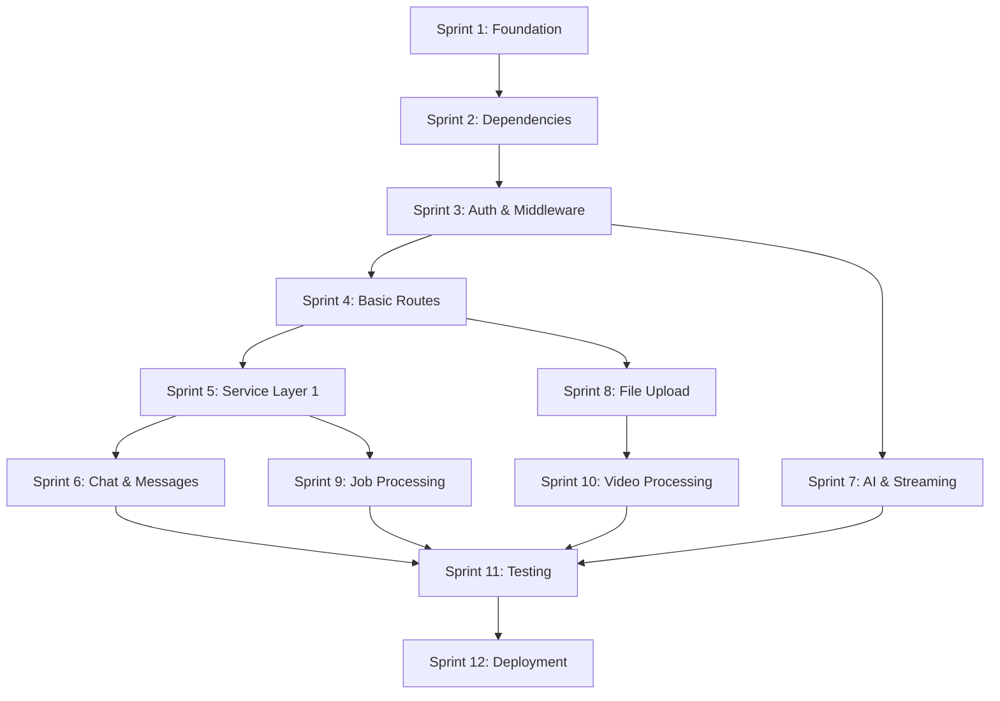

# FastAPI to Hono Migration - Detailed Sprint Breakdown

> **⚠️ MIGRATION COMPLETED** - This document is kept for historical reference. The migration was successfully completed ahead of schedule in December 2025.

## 🎯 Sprint Overview

**Total Duration**: 6 weeks (12 sprints of 2-3 days each) - *COMPLETED EARLY*
**Approach**: Aggressive migration with breaking changes allowed (zero users)
**Goal**: Complete replacement of FastAPI with Hono + TypeScript - *✅ ACHIEVED*

---

## 🚀 Sprint 1: Foundation & Project Setup (Days 1-2)

### Sprint Goal
Set up the basic TypeScript/Hono project structure and development environment.

### Atomic Tasks

#### 1.1 Project Structure Creation
- [ ] Create `apps/core/src/` directory
- [ ] Create `apps/core/src/index.ts` (empty file)
- [ ] Create `apps/core/src/routes/` directory
- [ ] Create `apps/core/src/middleware/` directory
- [ ] Create `apps/core/src/services/` directory
- [ ] Create `apps/core/src/lib/` directory
- [ ] Create `apps/core/src/types/` directory
- [ ] Create `apps/core/src/schemas/` directory
- [ ] Create `apps/core/src/config/` directory
- [ ] Create `apps/core/tests/` directory

#### 1.2 TypeScript Configuration
- [ ] Create `apps/core/tsconfig.json` with strict settings
- [ ] Configure path mapping for clean imports
- [ ] Set up build output to `dist/` directory
- [ ] Configure source maps for debugging
- [ ] Set target to ES2022 for modern features

#### 1.3 Package.json Setup
- [ ] Update `apps/core/package.json` name to include TypeScript
- [ ] Add Hono core dependencies
- [ ] Add TypeScript and build dependencies
- [ ] Add testing dependencies (Vitest)
- [ ] Add linting dependencies (ESLint, Prettier)
- [ ] Configure scripts for dev, build, test, lint

#### 1.4 Development Scripts
- [ ] Create `dev:hono` script in root package.json
- [ ] Update turbo.json to include Hono tasks
- [ ] Test that `bun dev:hono` starts successfully
- [ ] Configure hot reload with tsx/nodemon
- [ ] Set up concurrent running with existing FastAPI

#### 1.5 Basic Hono App
- [ ] Implement basic Hono app in `src/index.ts`
- [ ] Add simple health check route `GET /`
- [ ] Configure app to run on port 8001 (different from FastAPI)
- [ ] Test that server starts and responds
- [ ] Add basic error handling

### Definition of Done
- [ ] TypeScript project compiles without errors
- [ ] Basic Hono server runs on port 8001
- [ ] Health check endpoint returns 200
- [ ] Development scripts work correctly
- [ ] Both FastAPI (8000) and Hono (8001) can run concurrently

---

## 🚀 Sprint 2: Core Dependencies & Environment (Days 3-4)

### Sprint Goal
Install and configure all required dependencies and environment setup.

### Atomic Tasks

#### 2.1 Core Dependencies Installation
- [ ] Install `hono` latest version
- [ ] Install `@hono/node-server` for Node.js runtime
- [ ] Install `@hono/zod-validator` for request validation
- [ ] Install `zod` for schema validation
- [ ] Install `dotenv` for environment variables
- [ ] Install `cors` middleware dependencies

#### 2.2 Database Dependencies
- [ ] Install `@supabase/supabase-js` latest version
- [ ] Install `pg` and `@types/pg` for PostgreSQL
- [ ] Install `uuid` and `@types/uuid` for ID generation
- [ ] Remove SQLAlchemy Python dependencies (document for later)

#### 2.3 External Service Dependencies
- [ ] Install `@google-cloud/storage`
- [ ] Install `@google-cloud/aiplatform`
- [ ] Install `@google-cloud/secret-manager`
- [ ] Install `openai` latest version
- [ ] Install `redis` and `@types/redis`
- [ ] Install `multer` and `@types/multer` for file uploads

#### 2.4 Development Dependencies
- [ ] Install `typescript` latest version
- [ ] Install `@types/node` for Node.js types
- [ ] Install `tsx` for TypeScript execution
- [ ] Install `vitest` for testing
- [ ] Install `eslint` and TypeScript ESLint plugins
- [ ] Install `prettier` for code formatting

#### 2.5 Environment Configuration
- [ ] Create `apps/core/.env.example` with all required variables
- [ ] Copy existing Python environment variables
- [ ] Add new TypeScript-specific variables
- [ ] Create `src/config/environment.ts` for env validation
- [ ] Test environment loading and validation
- [ ] Document environment setup in README

#### 2.6 Linting & Formatting Setup
- [ ] Create `.eslintrc.js` with TypeScript rules
- [ ] Create `.prettierrc` with formatting rules
- [ ] Add pre-commit hooks with Husky
- [ ] Configure VSCode settings for auto-format
- [ ] Test linting and formatting commands

### Definition of Done
- [ ] All dependencies installed and working
- [ ] Environment variables properly loaded
- [ ] Linting and formatting configured
- [ ] No TypeScript compilation errors
- [ ] Development environment fully functional

---

## 🚀 Sprint 3: Authentication & Middleware Foundation (Days 5-6)

### Sprint Goal
Implement core middleware and authentication system.

### Atomic Tasks

#### 3.1 Supabase Client Setup
- [ ] Create `src/lib/database/supabase.ts`
- [ ] Configure Supabase client with environment variables
- [ ] Add connection testing function
- [ ] Create database utility functions
- [ ] Test Supabase connection

#### 3.2 Authentication Middleware
- [ ] Create `src/middleware/auth.ts`
- [ ] Implement JWT token extraction from headers
- [ ] Add Supabase token validation
- [ ] Create user context setting
- [ ] Add error handling for invalid tokens
- [ ] Create optional auth middleware variant

#### 3.3 Core Middleware Stack
- [ ] Create `src/middleware/cors.ts` with proper CORS setup
- [ ] Create `src/middleware/logger.ts` for request logging
- [ ] Create `src/middleware/error-handler.ts` for global errors
- [ ] Create `src/middleware/performance.ts` for timing
- [ ] Create `src/middleware/validation.ts` for request validation

#### 3.4 Authentication Types
- [ ] Create `src/types/auth.ts` with user types
- [ ] Define AuthenticatedUser interface
- [ ] Create JWT payload types
- [ ] Add authentication context types
- [ ] Export all auth-related types

#### 3.5 Middleware Integration
- [ ] Update main app to use middleware stack
- [ ] Test middleware order and execution
- [ ] Add middleware to health check route
- [ ] Test authentication flow with dummy token
- [ ] Verify error handling works correctly

#### 3.6 Authentication Testing
- [ ] Create test utilities for auth
- [ ] Test valid token scenarios
- [ ] Test invalid token scenarios
- [ ] Test missing token scenarios
- [ ] Test middleware bypass for public routes

### Definition of Done
- [ ] Authentication middleware working correctly
- [ ] All core middleware implemented and tested
- [ ] Supabase integration functional
- [ ] Error handling properly configured
- [ ] Authentication flow matches FastAPI behavior

---

## 🚀 Sprint 4: Basic API Routes Structure (Days 7-8)

### Sprint Goal
Create the basic route structure and implement simple endpoints.

### Atomic Tasks

#### 4.1 Route Structure Setup
- [ ] Create `src/routes/index.ts` as route aggregator
- [ ] Create `src/routes/health.ts` for health checks
- [ ] Create `src/routes/users.ts` for user endpoints
- [ ] Create `src/routes/chats.ts` for chat endpoints
- [ ] Create `src/routes/messages.ts` for message endpoints
- [ ] Create `src/routes/upload.ts` for file upload

#### 4.2 Health Check Routes
- [ ] Implement `GET /` basic health check
- [ ] Implement `GET /health` detailed health check
- [ ] Add database connectivity check
- [ ] Add Redis connectivity check
- [ ] Add external service checks
- [ ] Return proper HTTP status codes

#### 4.3 User Routes Foundation
- [ ] Implement `GET /users/:id` endpoint
- [ ] Add authentication middleware to user routes
- [ ] Create user response schemas with Zod
- [ ] Add proper error handling
- [ ] Test user endpoint with mock data

#### 4.4 Request/Response Schemas
- [ ] Create `src/schemas/user.ts` with Zod schemas
- [ ] Create `src/schemas/chat.ts` with Zod schemas
- [ ] Create `src/schemas/message.ts` with Zod schemas
- [ ] Create `src/schemas/common.ts` for shared schemas
- [ ] Add validation middleware integration

#### 4.5 Route Integration
- [ ] Mount all routes in main app
- [ ] Configure route prefixes (if needed)
- [ ] Test route resolution and middleware
- [ ] Add route-level error handling
- [ ] Verify authentication on protected routes

#### 4.6 Basic Testing Setup
- [ ] Create test utilities for route testing
- [ ] Set up test database/mocking
- [ ] Write tests for health check routes
- [ ] Write tests for user routes
- [ ] Test authentication integration

### Definition of Done
- [ ] Basic route structure implemented
- [ ] Health checks working with real service checks
- [ ] User routes functional with authentication
- [ ] Request/response validation working
- [ ] Basic test suite passing

---

## 🚀 Sprint 5: Service Layer Migration - Part 1 (Days 9-10)

### Sprint Goal
Convert core Python services to TypeScript, starting with user and chat services.

### Atomic Tasks

#### 5.1 Service Base Classes
- [ ] Create `src/services/base-service.ts` with common patterns
- [ ] Add error handling patterns
- [ ] Create service dependency injection setup
- [ ] Add logging integration
- [ ] Create service testing utilities

#### 5.2 User Service Migration
- [ ] Analyze Python `user_service.py` functionality
- [ ] Create `src/services/user-service.ts`
- [ ] Convert `get_user_profile` method
- [ ] Convert user validation methods
- [ ] Add TypeScript types for all methods
- [ ] Test user service functionality

#### 5.3 Chat Service Migration - Basic CRUD
- [ ] Analyze Python `chat_service.py` functionality
- [ ] Create `src/services/chat-service.ts`
- [ ] Convert `get_chats` method with pagination
- [ ] Convert `create_chat` method
- [ ] Convert `get_chat` method
- [ ] Convert `update_chat` method
- [ ] Convert `delete_chat` method

#### 5.4 Repository Pattern Setup
- [ ] Create `src/repositories/base-repository.ts`
- [ ] Create `src/repositories/user-repository.ts`
- [ ] Create `src/repositories/chat-repository.ts`
- [ ] Convert Python repository methods to TypeScript
- [ ] Add proper error handling and types

#### 5.5 Database Integration
- [ ] Update Supabase client for service usage
- [ ] Create database query utilities
- [ ] Add transaction support
- [ ] Test database operations
- [ ] Add connection pooling configuration

#### 5.6 Service Integration Testing
- [ ] Create service integration tests
- [ ] Test user service with real database
- [ ] Test chat service CRUD operations
- [ ] Test error scenarios
- [ ] Verify data consistency

### Definition of Done
- [ ] User service fully migrated and tested
- [ ] Chat service basic CRUD operations working
- [ ] Repository pattern implemented
- [ ] Database integration functional
- [ ] Service tests passing

---

## 🚀 Sprint 6: Chat & Message Endpoints (Days 11-12)

### Sprint Goal
Implement complete chat and message API endpoints.

### Atomic Tasks

#### 6.1 Chat Endpoints Implementation
- [ ] Implement `GET /chats` with pagination and auth
- [ ] Implement `POST /chats` with validation
- [ ] Implement `GET /chats/:id` with auth check
- [ ] Implement `PUT /chats/:id` with validation
- [ ] Implement `DELETE /chats/:id` with auth check
- [ ] Add proper error responses for all endpoints

#### 6.2 Message Service Migration
- [ ] Analyze Python `chat_service.py` message methods
- [ ] Convert `create_message` method
- [ ] Convert `get_chat_messages` method
- [ ] Add message validation and sanitization
- [ ] Create message repository methods

#### 6.3 Message Endpoints Implementation
- [ ] Implement `POST /messages` with validation
- [ ] Implement `GET /chats/:id/messages` with pagination
- [ ] Add message filtering capabilities
- [ ] Add proper authentication checks
- [ ] Test message creation and retrieval

#### 6.4 Request Validation Enhancement
- [ ] Add comprehensive Zod schemas for all endpoints
- [ ] Implement request body validation
- [ ] Add query parameter validation
- [ ] Add path parameter validation
- [ ] Create validation error responses

#### 6.5 Response Formatting
- [ ] Standardize API response format
- [ ] Add pagination metadata
- [ ] Create consistent error response format
- [ ] Add response timing headers
- [ ] Test response format consistency

#### 6.6 Endpoint Testing
- [ ] Write comprehensive endpoint tests
- [ ] Test authentication scenarios
- [ ] Test validation scenarios
- [ ] Test error scenarios
- [ ] Test pagination functionality

### Definition of Done
- [ ] All chat endpoints implemented and tested
- [ ] All message endpoints implemented and tested
- [ ] Request validation working correctly
- [ ] Response format standardized
- [ ] Authentication properly enforced

---

## 🚀 Sprint 7: AI Service & Streaming (Days 13-14)

### Sprint Goal
Migrate AI service and implement streaming chat functionality.

### Atomic Tasks

#### 7.1 AI Service Migration
- [ ] Analyze Python `ai_service.py` functionality
- [ ] Create `src/services/ai-service.ts`
- [ ] Convert OpenAI client integration
- [ ] Convert Google AI integration
- [ ] Add streaming response handling
- [ ] Test AI service connectivity

#### 7.2 Streaming Infrastructure
- [ ] Research Hono streaming capabilities
- [ ] Implement streaming response utilities
- [ ] Create streaming middleware
- [ ] Add proper headers for streaming
- [ ] Test basic streaming functionality

#### 7.3 Chat Streaming Endpoint
- [ ] Implement `POST /chat` streaming endpoint
- [ ] Convert Python streaming logic to TypeScript
- [ ] Add Vercel AI SDK compatibility
- [ ] Implement proper error handling in streams
- [ ] Test streaming with real AI responses

#### 7.4 Message Streaming Endpoint
- [ ] Implement `POST /stream-message` endpoint
- [ ] Add message persistence during streaming
- [ ] Implement streaming protocol handling
- [ ] Add proper authentication to streaming
- [ ] Test message streaming functionality

#### 7.5 AI Integration Testing
- [ ] Test OpenAI API integration
- [ ] Test Google AI integration
- [ ] Test streaming response handling
- [ ] Test error scenarios in AI calls
- [ ] Verify streaming protocol compatibility

#### 7.6 Performance Optimization
- [ ] Optimize streaming response times
- [ ] Add connection pooling for AI services
- [ ] Implement request queuing if needed
- [ ] Add timeout handling
- [ ] Test under load

### Definition of Done
- [ ] AI service fully migrated
- [ ] Streaming endpoints working correctly
- [ ] Vercel AI SDK compatibility maintained
- [ ] Performance meets requirements
- [ ] Error handling robust

---

## 🚀 Sprint 8: File Upload & Storage (Days 15-16)

### Sprint Goal
Implement file upload functionality and storage integration.

### Atomic Tasks

#### 8.1 File Upload Infrastructure
- [ ] Research Hono file upload capabilities
- [ ] Install and configure multer or alternative
- [ ] Create file upload middleware
- [ ] Add file validation (type, size)
- [ ] Test basic file upload

#### 8.2 Storage Service Migration
- [ ] Analyze Python storage integration
- [ ] Create `src/services/storage-service.ts`
- [ ] Convert Google Cloud Storage integration
- [ ] Add file upload to cloud storage
- [ ] Add file deletion functionality

#### 8.3 Upload Endpoints
- [ ] Implement `POST /test/upload` endpoint
- [ ] Add file validation and processing
- [ ] Implement file metadata extraction
- [ ] Add progress tracking (if needed)
- [ ] Test file upload flow

#### 8.4 File Processing
- [ ] Add file type validation
- [ ] Implement file size limits
- [ ] Add virus scanning (if required)
- [ ] Create file naming conventions
- [ ] Add file cleanup utilities

#### 8.5 Storage Integration
- [ ] Test Google Cloud Storage integration
- [ ] Add proper error handling for storage
- [ ] Implement file URL generation
- [ ] Add file access permissions
- [ ] Test file retrieval

#### 8.6 Upload Testing
- [ ] Test various file types
- [ ] Test file size limits
- [ ] Test upload error scenarios
- [ ] Test storage integration
- [ ] Performance test file uploads

### Definition of Done
- [ ] File upload working correctly
- [ ] Storage integration functional
- [ ] File validation implemented
- [ ] Error handling robust
- [ ] Upload performance acceptable

---

## 🚀 Sprint 9: Job Processing System (Days 17-18)

### Sprint Goal
Migrate job processing system and implement job endpoints.

### Atomic Tasks

#### 9.1 Job Service Migration
- [ ] Analyze Python `job_service.py` functionality
- [ ] Create `src/services/job-service.ts`
- [ ] Convert job creation methods
- [ ] Convert job status tracking
- [ ] Convert job filtering and pagination
- [ ] Add job validation logic

#### 9.2 Job Repository Migration
- [ ] Create `src/repositories/job-repository.ts`
- [ ] Convert job database operations
- [ ] Add job status updates
- [ ] Implement job filtering
- [ ] Add job cleanup utilities

#### 9.3 Job Endpoints Implementation
- [ ] Implement `GET /api/v1/jobs` with filtering
- [ ] Add pagination to job endpoints
- [ ] Add job status filtering
- [ ] Implement proper authentication
- [ ] Test job endpoint functionality

#### 9.4 Job Types and Schemas
- [ ] Create `src/types/job.ts` with job types
- [ ] Create `src/schemas/job.ts` with validation
- [ ] Add job status enums
- [ ] Create job response schemas
- [ ] Test schema validation

#### 9.5 Background Job Integration
- [ ] Research Node.js job queue options
- [ ] Integrate with existing job system
- [ ] Add job progress tracking
- [ ] Implement job retry logic
- [ ] Test job processing flow

#### 9.6 Job Testing
- [ ] Test job creation and retrieval
- [ ] Test job status updates
- [ ] Test job filtering and pagination
- [ ] Test authentication on job endpoints
- [ ] Test error scenarios

### Definition of Done
- [ ] Job service fully migrated
- [ ] Job endpoints implemented and tested
- [ ] Job processing integration working
- [ ] Authentication properly enforced
- [ ] Job system performance acceptable

---

## 🚀 Sprint 10: Video Processing Integration (Days 19-20)

### Sprint Goal
Migrate video processing functionality and endpoints.

### Atomic Tasks

#### 10.1 Video Service Migration
- [ ] Analyze Python `video_processing_service.py`
- [ ] Create `src/services/video-service.ts`
- [ ] Convert video processing methods
- [ ] Add video metadata extraction
- [ ] Integrate with FFmpeg (if needed)
- [ ] Test video processing functionality

#### 10.2 Video Repository Migration
- [ ] Create `src/repositories/video-repository.ts`
- [ ] Convert video database operations
- [ ] Add video metadata storage
- [ ] Implement video file tracking
- [ ] Add video cleanup utilities

#### 10.3 Video Endpoints Implementation
- [ ] Implement video upload endpoints
- [ ] Add video processing triggers
- [ ] Implement video status tracking
- [ ] Add video metadata endpoints
- [ ] Test video endpoint functionality

#### 10.4 Video Processing Pipeline
- [ ] Integrate with existing video pipeline
- [ ] Add video format validation
- [ ] Implement video compression
- [ ] Add thumbnail generation
- [ ] Test video processing flow

#### 10.5 Video Storage Integration
- [ ] Integrate video storage with cloud
- [ ] Add video URL generation
- [ ] Implement video access controls
- [ ] Add video streaming capabilities
- [ ] Test video storage and retrieval

#### 10.6 Video Testing
- [ ] Test video upload and processing
- [ ] Test video metadata extraction
- [ ] Test video storage integration
- [ ] Test video streaming
- [ ] Performance test video operations

### Definition of Done
- [ ] Video service fully migrated
- [ ] Video endpoints implemented
- [ ] Video processing pipeline working
- [ ] Video storage integration functional
- [ ] Video system performance acceptable

---

## 🚀 Sprint 11: Testing & Quality Assurance (Days 21-22)

### Sprint Goal
Comprehensive testing and quality assurance of the entire system.

### Atomic Tasks

#### 11.1 Unit Test Coverage
- [ ] Write unit tests for all services
- [ ] Write unit tests for all repositories
- [ ] Write unit tests for all middleware
- [ ] Write unit tests for utilities
- [ ] Achieve 90%+ unit test coverage

#### 11.2 Integration Test Suite
- [ ] Write integration tests for all endpoints
- [ ] Test authentication flows
- [ ] Test file upload flows
- [ ] Test streaming functionality
- [ ] Test error scenarios

#### 11.3 API Compatibility Testing
- [ ] Test all endpoints against FastAPI behavior
- [ ] Verify response format compatibility
- [ ] Test authentication compatibility
- [ ] Test error response compatibility
- [ ] Document any breaking changes

#### 11.4 Performance Testing
- [ ] Load test all endpoints
- [ ] Stress test streaming functionality
- [ ] Test file upload performance
- [ ] Test database query performance
- [ ] Optimize slow operations

#### 11.5 Security Testing
- [ ] Test authentication bypass attempts
- [ ] Test input validation security
- [ ] Test file upload security
- [ ] Test SQL injection prevention
- [ ] Test XSS prevention

#### 11.6 End-to-End Testing
- [ ] Test complete user workflows
- [ ] Test chat creation and messaging
- [ ] Test file upload and processing
- [ ] Test job processing flows
- [ ] Test error recovery scenarios

### Definition of Done
- [ ] All tests passing
- [ ] Performance meets requirements
- [ ] Security vulnerabilities addressed
- [ ] API compatibility verified
- [ ] System ready for production

---

## 🚀 Sprint 12: Deployment & Migration (Days 23-24)

### Sprint Goal
Deploy Hono system and complete migration from FastAPI.

### Atomic Tasks

#### 12.1 Production Configuration
- [ ] Create production environment configuration
- [ ] Set up production database connections
- [ ] Configure production logging
- [ ] Set up monitoring and alerting
- [ ] Test production configuration

#### 12.2 Docker Configuration
- [ ] Create new Dockerfile for Hono
- [ ] Update docker-compose.yml
- [ ] Test Docker build and run
- [ ] Optimize Docker image size
- [ ] Test container deployment

#### 12.3 CI/CD Pipeline Update
- [ ] Update GitHub Actions for TypeScript
- [ ] Add TypeScript build steps
- [ ] Update test pipeline
- [ ] Add deployment automation
- [ ] Test CI/CD pipeline

#### 12.4 Frontend Integration
- [ ] Update frontend API calls to use Hono
- [ ] Test frontend integration
- [ ] Update API client configurations
- [ ] Test authentication flow
- [ ] Verify all features working

#### 12.5 Migration Execution
- [ ] Deploy Hono to production environment
- [ ] Switch traffic from FastAPI to Hono
- [ ] Monitor system performance
- [ ] Verify all functionality working
- [ ] Address any issues immediately

#### 12.6 Cleanup and Documentation
- [ ] Remove FastAPI code (backup first)
- [ ] Update documentation
- [ ] Update README files
- [ ] Document new development workflow
- [ ] Create troubleshooting guide

### Definition of Done
- [ ] Hono system deployed to production
- [ ] Frontend successfully integrated
- [ ] FastAPI system decommissioned
- [ ] All functionality verified working
- [ ] Documentation updated

---

## 📊 Sprint Success Metrics

### Per Sprint Metrics
- [ ] All tasks completed
- [ ] No blocking issues
- [ ] Tests passing
- [ ] Code review completed
- [ ] Documentation updated

### Overall Success Criteria
- [ ] 100% API endpoint parity
- [ ] Performance improved or maintained
- [ ] Zero data loss
- [ ] Frontend integration seamless
- [ ] Development workflow improved

---

## 🚨 Risk Mitigation

### High-Risk Tasks
- **Authentication Migration**: Test thoroughly with real tokens
- **Streaming Implementation**: Verify compatibility with frontend
- **File Upload**: Test with various file types and sizes
- **Database Migration**: Ensure data consistency

### Contingency Plans
- Keep FastAPI running until Hono is fully verified
- Maintain database backups before major changes
- Have rollback procedures documented
- Monitor system closely during migration

## 📋 Task Estimation & Dependencies

### Sprint Dependencies


### Task Complexity Estimates
| Sprint | Complexity | Risk Level | Dependencies     |
| ------ | ---------- | ---------- | ---------------- |
| 1      | Low        | Low        | None             |
| 2      | Medium     | Low        | Sprint 1         |
| 3      | High       | Medium     | Sprint 2         |
| 4      | Medium     | Low        | Sprint 3         |
| 5      | High       | Medium     | Sprint 4         |
| 6      | Medium     | Low        | Sprint 5         |
| 7      | High       | High       | Sprint 3         |
| 8      | Medium     | Medium     | Sprint 4         |
| 9      | Medium     | Low        | Sprint 5         |
| 10     | High       | Medium     | Sprint 8         |
| 11     | High       | Low        | Sprints 6,7,9,10 |
| 12     | Medium     | High       | Sprint 11        |

## 🔧 Detailed Implementation Commands

### Sprint 1 Commands
```bash
# Create directory structure
mkdir -p apps/core/src/{routes,middleware,services,lib,types,schemas,config}
mkdir -p apps/core/tests/{unit,integration,e2e}

# Initialize TypeScript
cd apps/core
touch tsconfig.json src/index.ts

# Update package.json
bun add hono @hono/node-server
bun add -d typescript @types/node tsx
```

### Sprint 2 Commands
```bash
# Install core dependencies
bun add @hono/zod-validator zod dotenv
bun add @supabase/supabase-js uuid
bun add @google-cloud/storage @google-cloud/aiplatform openai redis
bun add multer
bun add -d @types/uuid @types/multer @types/redis

# Development tools
bun add -d vitest eslint prettier @typescript-eslint/parser
```

### Sprint 3 Commands
```bash
# Create middleware files
touch src/middleware/{auth,cors,logger,error-handler,performance,validation}.ts
touch src/lib/database/supabase.ts
touch src/types/auth.ts
```

## 📝 Code Templates & Boilerplate

### Basic Hono App Template
```typescript
// src/index.ts
import { Hono } from 'hono'
import { serve } from '@hono/node-server'
import { cors } from 'hono/cors'
import { logger } from 'hono/logger'

const app = new Hono()

// Middleware
app.use('*', logger())
app.use('*', cors())

// Routes
app.get('/', (c) => {
  return c.json({
    message: 'Echo API (Hono) is running',
    timestamp: new Date().toISOString()
  })
})

const port = parseInt(process.env.PORT || '8001')
console.log(`🚀 Hono server starting on port ${port}`)

serve({
  fetch: app.fetch,
  port
})
```

### Authentication Middleware Template
```typescript
// src/middleware/auth.ts
import { createMiddleware } from 'hono/factory'
import { supabase } from '../lib/database/supabase'

export const authMiddleware = createMiddleware(async (c, next) => {
  const authHeader = c.req.header('Authorization')

  if (!authHeader?.startsWith('Bearer ')) {
    return c.json({ error: 'Unauthorized' }, 401)
  }

  const token = authHeader.replace('Bearer ', '')

  try {
    const { data: { user }, error } = await supabase.auth.getUser(token)

    if (error || !user) {
      return c.json({ error: 'Invalid token' }, 401)
    }

    c.set('user', user)
    await next()
  } catch (error) {
    return c.json({ error: 'Authentication failed' }, 401)
  }
})
```

### Service Base Class Template
```typescript
// src/services/base-service.ts
export abstract class BaseService {
  protected logger: Console = console

  protected handleError(error: unknown, context: string): never {
    this.logger.error(`Error in ${context}:`, error)
    throw new Error(`${context} failed: ${error instanceof Error ? error.message : 'Unknown error'}`)
  }

  protected validateRequired<T>(value: T | null | undefined, fieldName: string): T {
    if (value === null || value === undefined) {
      throw new Error(`${fieldName} is required`)
    }
    return value
  }
}
```

## 🧪 Testing Templates

### Route Test Template
```typescript
// tests/integration/routes/example.test.ts
import { describe, it, expect, beforeEach, afterEach } from 'vitest'
import { testClient } from '../helpers/test-client'

describe('Example Routes', () => {
  beforeEach(async () => {
    // Setup test data
  })

  afterEach(async () => {
    // Cleanup test data
  })

  it('should handle GET request', async () => {
    const response = await testClient.get('/example')

    expect(response.status).toBe(200)
    expect(response.json()).toMatchObject({
      success: true
    })
  })

  it('should handle authenticated request', async () => {
    const response = await testClient.get('/protected', {
      headers: { Authorization: 'Bearer test-token' }
    })

    expect(response.status).toBe(200)
  })
})
```

### Service Test Template
```typescript
// tests/unit/services/example-service.test.ts
import { describe, it, expect, vi, beforeEach } from 'vitest'
import { ExampleService } from '../../../src/services/example-service'

describe('ExampleService', () => {
  let service: ExampleService

  beforeEach(() => {
    service = new ExampleService()
  })

  it('should perform operation successfully', async () => {
    // Mock dependencies
    const mockResult = { id: '1', name: 'test' }

    // Test the service method
    const result = await service.performOperation('test-input')

    expect(result).toEqual(mockResult)
  })
})
```

## 📊 Progress Tracking

### Sprint Completion Checklist
```markdown
## Sprint X Completion Checklist

### Code Quality
- [ ] All TypeScript errors resolved
- [ ] ESLint passes with no errors
- [ ] Prettier formatting applied
- [ ] No console.log statements in production code
- [ ] All TODO comments addressed

### Testing
- [ ] Unit tests written and passing
- [ ] Integration tests written and passing
- [ ] Test coverage > 80% for new code
- [ ] Manual testing completed
- [ ] Edge cases tested

### Documentation
- [ ] Code comments added where needed
- [ ] API documentation updated
- [ ] README updated if needed
- [ ] Migration notes documented

### Performance
- [ ] No memory leaks detected
- [ ] Response times acceptable
- [ ] Database queries optimized
- [ ] Error handling robust

### Security
- [ ] Input validation implemented
- [ ] Authentication working correctly
- [ ] Authorization checks in place
- [ ] No sensitive data exposed
```

## 🚨 Troubleshooting Guide

### Common Issues & Solutions

#### TypeScript Compilation Errors
```bash
# Clear TypeScript cache
rm -rf node_modules/.cache
bun install

# Check TypeScript configuration
npx tsc --noEmit --listFiles
```

#### Supabase Connection Issues
```typescript
// Test Supabase connection
const testConnection = async () => {
  try {
    const { data, error } = await supabase.from('users').select('count').limit(1)
    console.log('Supabase connection:', error ? 'Failed' : 'Success')
  } catch (err) {
    console.error('Supabase error:', err)
  }
}
```

#### Middleware Order Issues
```typescript
// Correct middleware order
app.use('*', logger())           // 1. Logging first
app.use('*', cors())             // 2. CORS
app.use('*', performanceMiddleware) // 3. Performance tracking
app.use('/protected/*', authMiddleware) // 4. Auth for protected routes
```

#### File Upload Problems
```bash
# Check file upload limits
# In Hono configuration
app.use('*', async (c, next) => {
  if (c.req.header('content-type')?.includes('multipart/form-data')) {
    // Set appropriate limits
  }
  await next()
})
```

## 📈 Performance Benchmarks

### Target Performance Metrics
| Endpoint               | Target Response Time  | Current FastAPI | Target Hono |
| ---------------------- | --------------------- | --------------- | ----------- |
| GET /                  | < 50ms                | ~80ms           | < 40ms      |
| GET /chats             | < 100ms               | ~150ms          | < 80ms      |
| POST /chats            | < 200ms               | ~250ms          | < 150ms     |
| POST /chat (streaming) | < 500ms to first byte | ~800ms          | < 400ms     |
| POST /upload           | < 2s for 10MB         | ~3s             | < 1.5s      |

### Performance Testing Commands
```bash
# Install performance testing tools
bun add -d autocannon

# Test endpoint performance
npx autocannon -c 10 -d 30 http://localhost:8001/
npx autocannon -c 10 -d 30 -m POST -H "Content-Type: application/json" -b '{"test": true}' http://localhost:8001/chats
```

## 🔄 Migration Validation

### API Compatibility Validation
```typescript
// Create compatibility test suite
describe('API Compatibility', () => {
  const fastApiBase = 'http://localhost:8000'
  const honoBase = 'http://localhost:8001'

  it('should return same response format', async () => {
    const fastApiResponse = await fetch(`${fastApiBase}/chats`)
    const honoResponse = await fetch(`${honoBase}/chats`)

    const fastApiData = await fastApiResponse.json()
    const honoData = await honoResponse.json()

    expect(honoData).toMatchObject(fastApiData)
  })
})
```

### Data Migration Validation
```sql
-- Validate data consistency
SELECT
  COUNT(*) as total_records,
  COUNT(DISTINCT id) as unique_ids,
  MIN(created_at) as earliest_record,
  MAX(updated_at) as latest_update
FROM chats;
```

---

*This comprehensive sprint breakdown provides every atomic task needed for the complete FastAPI to Hono migration with zero users, allowing for aggressive development and breaking changes.*
