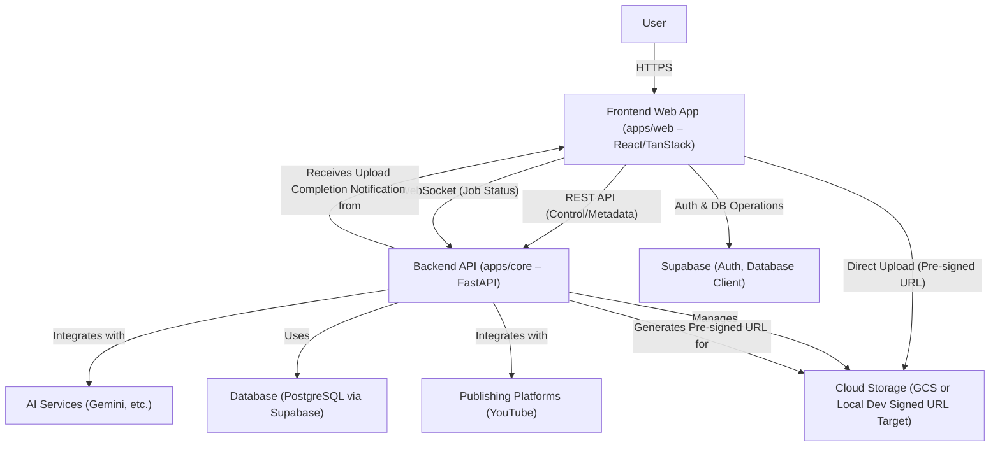

# Echo Platform Architecture

---

## 1. Overall Architecture Philosophy

The Echo platform is designed as a distributed system with a clear separation between the backend API (`apps/core`) and the frontend web application (`apps/web`). The backend is responsible for video processing, AI integration, database interactions, and core business logic. The frontend handles user interaction, presentation, and client-side state management.

Communication primarily occurs via RESTful APIs for control and metadata, WebSockets for real-time job status updates, and direct-to-cloud uploads (via pre-signed URLs) for large video files to minimize backend server load.



This document outlines the current structure and how the frontend will integrate with existing backend services and Supabase, leveraging established system patterns, including WebSockets for real-time updates and direct-to-cloud uploads.

---

## 2. Backend Architecture (`apps/core`)

The backend architecture for `apps/core` is established and follows Clean Architecture principles. This structure serves as the stable foundation for frontend integration.

### 2.1. Core Principles & Patterns (Recap from `system-patterns.md`)
*   **Clean Architecture Layers:** Domain, Application, Adapters, Infrastructure.
*   **Repository Pattern:** Data access abstracted via repositories in `apps/core/operations/`.
*   **Adapter Pattern:** For all external services (AI, Storage, Publishing) in `apps/core/lib/`.
*   **Dependency Injection:** Used for decoupling.
*   **SQLAlchemy ORM:** For database interactions, with models in `apps/core/models/`.
*   **FastAPI Framework:** For API endpoints, request/response handling, Pydantic schemas, and WebSocket handling (`apps/core/api/`).
*   **Centralized Configuration:** Pydantic `Settings` in `apps/core/core/config.py`.
*   **Asynchronous Operations:** Leveraging `async/await` for I/O-bound tasks.

### 2.2. Current Backend File Structure (`apps/core`)
(Structure remains as previously documented, no changes here based on decisions)
```
apps/core/
├── alembic/                # Database migrations
│   ├── versions/
│   └── ...
├── api/                    # FastAPI routes and Pydantic schemas
│   ├── endpoints/          # API route handlers (e.g., video_processing_endpoints.py, websocket_endpoints.py - NEW)
│   └── schemas/            # Pydantic schemas (e.g., video_processing_schemas.py)
├── core/                   # Core application setup (config.py, exceptions.py)
├── lib/                    # Common libraries and adapters for external services
│   ├── ai/                 # AI service adapters (gemini_adapter.py)
│   ├── auth/               # Authentication utilities (supabase_auth.py)
│   ├── cache/              # Caching mechanisms (redis_cache.py)
│   ├── database/           # Database connection (connection.py)
│   ├── messaging/          # (e.g., email.py, websocket_manager.py - NEW)
│   ├── publishing/         # Publishing adapters (youtube_adapter.py)
│   ├── storage/            # Storage adapters (file_storage.py for local/GCS)
│   └── utils/              # General utilities (ffmpeg_utils.py, file_utils.py)
├── models/                 # SQLAlchemy ORM models (video_model.py, video_job_model.py, etc.)
├── operations/             # Repository implementations (video_repository.py, video_job_repository.py)
├── services/               # Service layer, business logic orchestration (video_processing_service.py - MODIFIED for WebSocket events)
├── tests/                  # Automated tests (unit, integration)
├── main.py                 # FastAPI app instantiation and router registration
├── pyproject.toml          # Project metadata and dependencies (managed by uv)
└── README.md               # Backend specific documentation
```

### 2.3. Key Backend Endpoints & Functionality for Frontend Interaction
*   **Video Upload Flow (Direct-to-Cloud):**
    *   `POST /api/v1/videos/signed-upload-url`: **NEW**. Frontend requests a pre-signed URL to upload directly to GCS.
        *   Request: `{ filename: string, contentType: string }`
        *   Response: `{ uploadUrl: string, videoId: string (or temporary correlation ID) }`
    *   `POST /api/v1/videos/upload-complete`: **NEW**. Frontend notifies backend after successful direct upload.
        *   Request: `{ videoId: string (or correlation ID), originalFilename: string, storagePath: string, contentType: string, sizeBytes: number }`
        *   Action: Finalizes video record, initiates processing job.
*   **Data Retrieval & Management:**
    *   `GET /api/v1/videos/jobs/{job_id}`: To fetch the status and results of a processing job (still useful for direct linking or if polling is a fallback).
    *   `GET /api/v1/videos` or `GET /api/v1/users/me/videos`: **NEW**. To list videos for the authenticated user (paginated).
    *   `GET /api/v1/videos/{videoId}/details`: **NEW**. To get comprehensive details for a specific video, including related job and metadata.
    *   `PUT /api/v1/videos/{videoId}/metadata`: **NEW**. To update video metadata.
*   **Video Playback:**
    *   The `GET /api/v1/videos/{videoId}/details` endpoint will include a `playbackUrl` (e.g., a GCS signed URL for reading the video object) or the backend will provide a streaming endpoint `GET /api/v1/stream/video/{videoId}`. Generating signed URLs for playback is preferred for GCS.
*   **Real-time Updates (WebSockets):**
    *   `WS /ws/jobs/status/{user_id}` (or similar): **NEW**. Frontend connects to this WebSocket endpoint after login to receive real-time updates on job statuses for that user. The `VideoProcessingService` will publish events that are broadcast over this WebSocket.

---

## 3. Frontend Architecture (`apps/web`)

The frontend application utilizes React, TypeScript, TanStack ecosystem, and `shadcn/ui`. It interfaces with Supabase for auth and the `apps/core` backend via REST APIs and WebSockets.

### 3.1. Core Frontend Principles & Patterns (from `system-patterns.md`)
*   **Component-Based Architecture, Routing, State Management (TanStack Query, Client State):** As previously defined.
*   **Authentication:** Direct integration with `Supabase` client library.
*   **API Communication:**
    *   Dedicated typed REST API client service (`apps/web/src/lib/api.ts`).
    *   Dedicated WebSocket client/hook (`apps/web/src/hooks/useAppWebSocket.ts` - **NEW**) for real-time job updates.
*   **TypeScript, Custom Hooks:** As previously defined.

### 3.2. Current Frontend File Structure (`apps/web`)
(Structure remains as previously documented, new files like `useAppWebSocket.ts` will be added)
```
apps/web/
├── public/                 # Static assets
├── src/
│   ├── api.ts              # (TanStack Start API handler)
│   ├── client.tsx          # Client-side entry point
│   ├── components/
│   │   ├── auth.tsx
│   │   ├── GoogleLoginButton.tsx
│   │   ├── ProtectedLayout.tsx
│   │   ├── shared/
│   │   ├── ui/
│   │   └── video/
│   │       ├── VideoUploadDropzone.tsx # MODIFIED for direct upload
│   │       ├── processing-dashboard.tsx # MODIFIED for WebSocket updates
│   │       ├── video-detail.tsx
│   │       └── ...
│   ├── hooks/
│   │   ├── useAuth.ts # (existing, to be verified)
│   │   ├── useJobStatus.ts # MODIFIED for WebSockets
│   │   ├── useAppWebSocket.ts # NEW
│   │   └── ...
│   ├── lib/
│   │   ├── api.ts          # Backend REST API client service - MODIFIED with new endpoints
│   │   └── utils.ts
│   ├── router.tsx
│   ├── routes/
│   │   ├── __root.tsx
│   │   ├── _authed.tsx
│   │   ├── dashboard.tsx
│   │   ├── login.tsx
│   │   ├── signup.tsx
│   │   ├── auth/callback.tsx
│   │   ├── jobs/[jobId].tsx # (new or adapted)
│   │   └── video.$videoId.tsx
│   ├── services/
│   ├── styles/
│   ├── types/
│   │   └── api.ts # (new or existing, for API client types)
│   └── utils/
├── ... (config files)
└── README.md
```

### 3.3. Frontend Integration Architecture (Focus Areas)

**A. Authentication Module & Supabase Client Integration:** (Largely unchanged from previous detailed plan, focusing on `useAuth.ts`)

**B. Backend API Client Service (`apps/web/src/lib/api.ts`):**
*   Updated to include functions for new backend REST endpoints: `getSignedUploadUrl`, `notifyUploadComplete`, `getMyVideos` (with pagination), `getVideoDetails`, `updateVideoMetadata`.

**C. Video Processing Workflow Components:**
*   **Video Upload (`apps/web/src/components/video/VideoUploadDropzone.tsx`):**
    *   Implements 3-step direct-to-cloud upload:
        1.  Call `api.getSignedUploadUrl()`.
        2.  Upload file directly to the `uploadUrl` (GCS) using `fetch` or `axios`, showing progress.
        3.  Call `api.notifyUploadComplete()` upon successful GCS upload.
*   **Job Status (`apps/web/src/routes/jobs/[jobId].tsx` or similar):**
    *   Primarily relies on WebSocket updates via `useAppWebSocket.ts` and `useJobStatus.ts` to update `TanStack Query` cache for job data.
    *   Polling via `GET /videos/jobs/{job_id}` becomes a fallback or for initial data load if WebSocket connection is pending.
*   **Video Dashboard & List (`apps/web/src/routes/dashboard.tsx`):**
    *   Uses `api.getMyVideos()` with pagination support.
*   **Video Detail & Player (`apps/web/src/routes/video/[videoId].tsx`):**
    *   Fetches details using `api.getVideoDetails()`.
    *   Video playback will use a `playbackUrl` provided by the backend (ideally a GCS signed URL) or stream from a backend endpoint.
    *   Metadata editing calls `api.updateVideoMetadata()`.

**D. Real-time Communication (`apps/web/src/hooks/useAppWebSocket.ts`):**
*   **NEW Hook:** `useAppWebSocket.ts` will establish and manage the WebSocket connection to the backend (e.g., `/ws/jobs/status/{user_id}`).
*   It will handle incoming messages and provide a way for other hooks/components (like `useJobStatus.ts`) to subscribe to relevant updates or use received data to update `TanStack Query`'s cache.

**E. State Management:** (Unchanged: `TanStack Query` for server state, local/Context for UI state)

---

## 4. Supabase Integration (`supabase/`)
(Role and structure remain as previously documented. RLS is key.)
```
supabase/
├── clients/
│   ├── client.ts
│   └── server.ts
├── index.ts
├── migrations/
│   └── ...
├── mutations/
│   └── index.ts
├── package.json
├── supabase/ # Supabase CLI project files
└── types/
    └── db.ts
```
*   **Authentication Provider:** For `apps/web` and JWT validation in `apps/core`.
*   **Database:** Primary data store for `apps/core`.
*   **Row Level Security (RLS):** Essential for data protection.

---

## 5. Communication Patterns

*   **Frontend to Backend API (`apps/web` -> `apps/core`):**
    *   RESTful HTTP/S for control actions (requesting signed URLs, notifying completion, fetching lists/details, updating metadata). Authenticated with Supabase JWT.
    *   WebSocket (WSS) for receiving real-time job status updates. Connection likely authenticated via initial handshake or token.
*   **Frontend to Supabase (`apps/web` -> Supabase Platform):** (Unchanged) Direct for Auth.
*   **Frontend to Cloud Storage (GCS):** Direct HTTP PUT for video file uploads using pre-signed URLs obtained from the backend.
*   **Backend to Supabase (`apps/core` -> Supabase Platform):** (Unchanged) Database ops via SQLAlchemy.

---

## 6. Cross-Cutting Concerns
(Managed as described in `system-patterns.md` and apply platform-wide)
*   Error Handling, Logging, Validation, Security, Configuration, Package Management.
*   **Configuration:** Standardized `.env.[mode]` files (e.g., `.env.development`, `.env.production`) are used in both `apps/core` and `apps/web` to manage environment-specific settings. Vite handles these for the frontend, while the backend (`apps/core`) loads them via its configuration setup (e.g., `config.py` using `python-dotenv`).

This revised architecture incorporates WebSockets for real-time updates and a direct-to-cloud upload strategy, providing a more scalable and responsive system. 