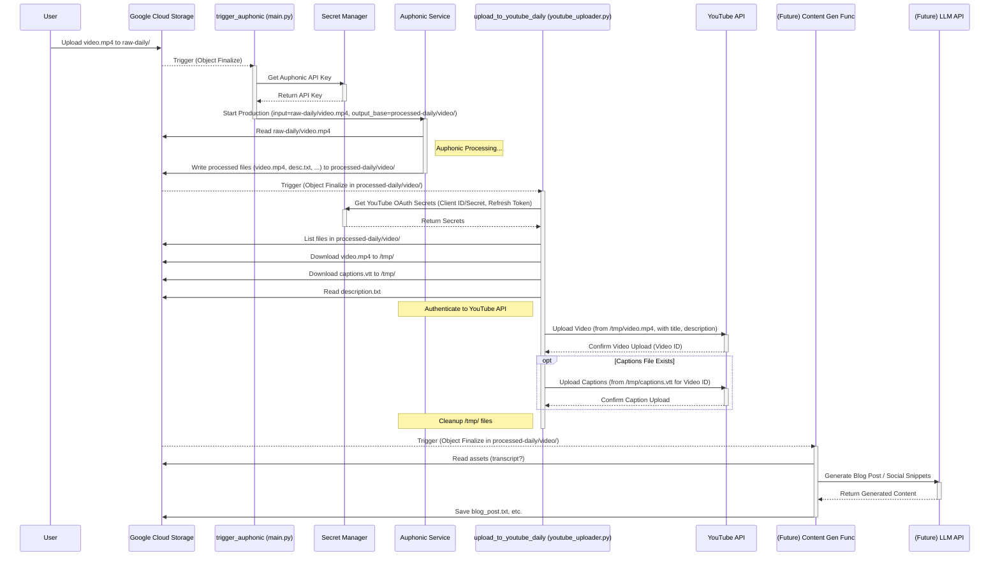

# Auphonic Video Processing & YouTube Automation

## Vision

This project automates the process of taking raw video uploads, enhancing their audio quality using Auphonic, organizing the processed files, and ultimately uploading them to designated YouTube channels. The goal is to create a seamless, hands-off pipeline from raw video to published content, potentially including future steps like blog post generation and social media snippets.

## Benefits ✨

*   **Time Savings:** Automates tedious manual steps of audio processing and uploading.
*   **Consistent Quality:** Ensures all videos benefit from Auphonic's audio enhancement presets.
*   **Organized Assets:** Automatically structures processed files (audio, video, transcripts) in GCS for easy access.
*   **Scalability:** Handles uploads for multiple channels (e.g., daily vs. main) based on input folder.
*   **Extensibility:** Designed with future automations (blogging, social media) in mind.

## Workflow Overview



**Detailed Steps:**

1.  **Upload:** A raw video file (e.g., `My Video.mp4`) is uploaded to a specific folder in the GCS Bucket (`raw-daily/` or `raw-main/`).
2.  **Trigger Auphonic Function:** The GCS upload triggers the `trigger_auphonic` Cloud Function (`main.py`).
3.  **Start Auphonic Job:** `trigger_auphonic` retrieves the Auphonic API key from Secret Manager. It determines the correct Auphonic preset and service UUID based on the input folder (`raw-daily` vs `raw-main`). It constructs a *structured output path* based on the video filename (e.g., `processed-daily/My_Video/`). It then calls the Auphonic API, telling it to process the input video and place all resulting output files into that GCS folder (`processed-daily/My_Video/`).
4.  **Auphonic Processing:** Auphonic accesses the raw video from GCS (using its pre-configured GCS External Service), processes it, and saves the output files (e.g., `My_Video.mp4`, `description.txt`, `captions.vtt`) into the specified folder (`processed-daily/My_Video/`).
5.  **Trigger YouTube Upload Function:** As Auphonic writes files into the `processed-daily/My_Video/` folder, each file finalization triggers the `upload_to_youtube_daily` Cloud Function (`youtube_uploader.py`).
6.  **Process Folder:** `upload_to_youtube_daily` identifies which folder was triggered (e.g., `processed-daily/My_Video/`). It lists the files within *that folder* to find the main processed video file (`.mp4`, `.mov`), the description (`description.txt`), and captions (`.vtt`, `.srt`).
7.  **Download & Auth:** It downloads the required files (video, captions) to its temporary local storage (`/tmp/`). It fetches the YouTube OAuth Client ID, Secret, and Refresh Token from Secret Manager to authenticate with the YouTube API for the target channel.
8.  **Upload to YouTube:** It uploads the downloaded video file to the correct YouTube channel (Daily in this case), setting the title (from the folder name), description (from `description.txt`), and other settings (privacy status, category). If captions were found and downloaded, it makes a separate API call to upload those as well.
9.  **Cleanup:** The function removes the temporary files it downloaded.
10. **(Future) Content Generation:** Other functions could later be triggered by files in `processed-*` folders to generate blog posts, social media content, etc.

## Key Terms

*   **GCS (Google Cloud Storage):** The service used for storing all video files (raw input, processed output).
    *   `raw-daily/`, `raw-main/`: Input folders where initial videos are uploaded.
    *   `processed-daily/`, `processed-main/`: Output parent folders where Auphonic results are stored.
    *   `processed-*/video_title/`: Structured folders created by the automation to hold all assets for a single processed video.
*   **Auphonic:** An external web service used for automatic audio post-production (leveling, noise reduction, etc.).
*   **Cloud Functions:** Serverless functions hosted on Google Cloud used to run the automation code.
*   **Secret Manager:** Google Cloud service for securely storing API keys and other secrets.
*   **Eventarc:** Google Cloud service used to connect events (like GCS uploads) to triggers for services like Cloud Functions.
*   **Service Account:** Google Cloud identity used by services (like Cloud Functions, GCS, Eventarc) to interact with other services and APIs.

## Core Components

*   **`main.py`:** Contains the primary Cloud Function `trigger_auphonic`.
    *   Triggered by GCS `object.finalize` events.
    *   Parses event data to get bucket/file name.
    *   Determines Auphonic preset/service based on input folder.
    *   Constructs structured output path.
    *   Retrieves API key from Secret Manager.
    *   Calls the Auphonic API (`/api/productions.json`) to start processing.
*   **`requirements.txt`:** Lists Python dependencies (`functions-framework`, `requests`, `google-cloud-secret-manager`, `google-cloud-storage`).
*   **`tasks/` directory:** Contains tasks managed by Task Master AI for project development.
*   **(Planned) YouTube Upload Functions:** Future components to handle uploading processed videos from `processed-*` folders to YouTube.
*   **(Planned) Content Generation Functions:** Future components to generate blog posts/social media content.

## Getting Started

### Prerequisites

1.  **Google Cloud Project:** An active GCP project.
2.  **Google Cloud SDK (`gcloud`):** Installed and authenticated (`gcloud auth login`, `gcloud config set project YOUR_PROJECT_ID`).
3.  **Python & Pip:** Python 3.10+ recommended.
4.  **Virtual Environment:** Recommended (e.g., `python -m venv venv`, `source venv/bin/activate`).
5.  **Auphonic Account:** Account with API access enabled.
6.  **GCS Bucket:** Created in a specific region (e.g., `us-east1`).
7.  **Auphonic API Key:** Stored in Google Secret Manager (e.g., secret ID `auphonic-api-key`).
8.  **Auphonic Presets & External Services:**
    *   Auphonic presets created for different processing needs (e.g., daily vs. main channel).
    *   Google Cloud Storage configured as an External Service in Auphonic, linked to your GCS bucket (this allows Auphonic to read input and write output). Note the Service UUIDs.

### Setup & Configuration

1.  **Clone Repository:** (Assuming it's created based on Task 12)
    ```bash
    git clone git@github.com:parkerrex/Automations.git
    cd Automations
    ```
2.  **Create Virtual Environment:**
    ```bash
    python -m venv venv
    source venv/bin/activate # On Windows use `venv\Scripts\activate`
    ```
3.  **Install Dependencies:**
    ```bash
    pip install -r requirements.txt
    ```
4.  **Configure `main.py`:**
    *   Update `PROJECT_ID` if different from `automations-457120`.
    *   Update `SECRET_ID` if different from `auphonic-api-key`.
    *   Update `PRESETS` dictionary with your actual Auphonic Preset UUIDs.
    *   Update `SERVICES` dictionary with your actual Auphonic GCS External Service UUIDs.
5.  **GCP Service Account Permissions:** Ensure the service account used for the Cloud Function (`gcsfuse-automation@...` in the example) has roles:
    *   `Secret Manager Secret Accessor` (to get API key)
    *   `Cloud Functions Developer` (or Invoker/Admin as needed)
    *   Any roles needed to interact with GCS if not already covered.
6.  **GCP API Enablement:** Ensure these APIs are enabled in your project:
    *   Cloud Functions API
    *   Cloud Build API
    *   Eventarc API
    *   Secret Manager API
    *   Cloud Storage API
    *   (Potentially others depending on future functions)
7.  **YouTube OAuth Credentials:** You need valid OAuth 2.0 credentials (Client ID, Client Secret) for a project with the YouTube Data API v3 enabled. These should be stored in Secret Manager (see Status section).
8.  **Eventarc & GCS Service Agent Permissions:** As encountered during deployment, ensure:
    *   The Eventarc Service Agent (`service-<PROJECT_NUMBER>@gcp-sa-eventarc.iam.gserviceaccount.com`) has `roles/eventarc.eventReceiver`.
    *   The GCS Service Account (`service-<PROJECT_NUMBER>@gs-project-accounts.iam.gserviceaccount.com`) has `roles/pubsub.publisher`.

### Deployment

Deploy the main Cloud Function using `gcloud`. **Ensure the `--region` matches your GCS bucket's region.**

```bash
gcloud functions deploy trigger-auphonic \
  --gen2 \
  --runtime=python310 \
  --region=YOUR_GCS_BUCKET_REGION \
  --source=. \
  --entry-point=trigger_auphonic \
  --trigger-event=google.storage.object.finalize \
  --trigger-resource=YOUR_GCS_BUCKET_NAME \
  --service-account=YOUR_FUNCTION_SERVICE_ACCOUNT_EMAIL \
  --set-env-vars=GCS_BUCKET=YOUR_GCS_BUCKET_NAME
```

Replace `YOUR_GCS_BUCKET_REGION`, `YOUR_GCS_BUCKET_NAME`, and `YOUR_FUNCTION_SERVICE_ACCOUNT_EMAIL` with your specific values.

## Current Status (As of April 18, 2025)

*   **Auphonic Processing:** The `trigger_auphonic` function is deployed and functional. It processes videos uploaded to `raw-daily/` and `raw-main/` and outputs structured results to `processed-daily/` and `processed-main/` folders respectively.
*   **YouTube Authentication:**
    *   OAuth 2.0 credentials (Client ID, Client Secret, Refresh Token) have been obtained for both the Daily (`me@parkerrex.com`) and Main (`parker.m.rex@gmail.com`) YouTube channels.
    *   These credentials have been securely stored in Google Secret Manager using specific naming conventions (e.g., `youtube-daily-client-id`, `youtube-main-refresh-token`).
*   **Daily YouTube Uploader (`upload_to_youtube_daily`):**
    *   Function structure created in `youtube_uploader.py`.
    *   Trigger logic (monitoring `processed-daily/`) is set up.
    *   Authentication logic (fetching secrets, refreshing tokens) is implemented.
    *   Basic metadata extraction (title from folder, description from `description.txt`) is implemented.
    *   Video download from GCS to `/tmp/` is implemented.
    *   Core video upload functionality to YouTube is implemented.
    *   Caption upload functionality (.vtt, .srt) is implemented.
    *   Basic cleanup of temporary files is included.
*   **Main YouTube Uploader (`upload_to_youtube_main`):** Placeholder function exists in `youtube_uploader.py`, but implementation is pending.

## Next Steps

1.  **Implement Main Channel Uploader:** Complete the `upload_to_youtube_main` function in `youtube_uploader.py`, mirroring the daily uploader logic but using the `MAIN_SECRETS` configuration.
2.  **Deploy YouTube Uploaders:** Deploy both `upload_to_youtube_daily` and `upload_to_youtube_main` Cloud Functions using `gcloud`, ensuring correct GCS triggers, path patterns (`processed-daily/*`, `processed-main/*`), and appropriate timeouts.
3.  **End-to-End Testing:** Thoroughly test the entire pipeline:
    *   Upload raw videos to `raw-daily/` and `raw-main/`.
    *   Verify Auphonic processing completes successfully.
    *   Verify processed files appear in the correct `processed-*/video_title/` folders.
    *   Verify the correct YouTube uploader function triggers.
    *   Verify videos appear on the correct YouTube channel (Daily or Main) with the correct title/description/privacy.
    *   Test caption uploads.
4.  **Refine & Enhance:** Based on testing, improve error handling, logging, and potentially enhance metadata extraction (e.g., using Auphonic's output, adding tags).
5.  **Implement Content Generation:** Begin work on Tasks 7, 8, 9 (Blog Posts, Social Media, Instagram).
6.  **Implement Monitoring:** Set up Task 10 (Monitoring & Error Handling).

## Contributing

(Placeholder - Add guidelines later if applicable)

## License

(Placeholder - Specify license, e.g., MIT, Apache 2.0)
