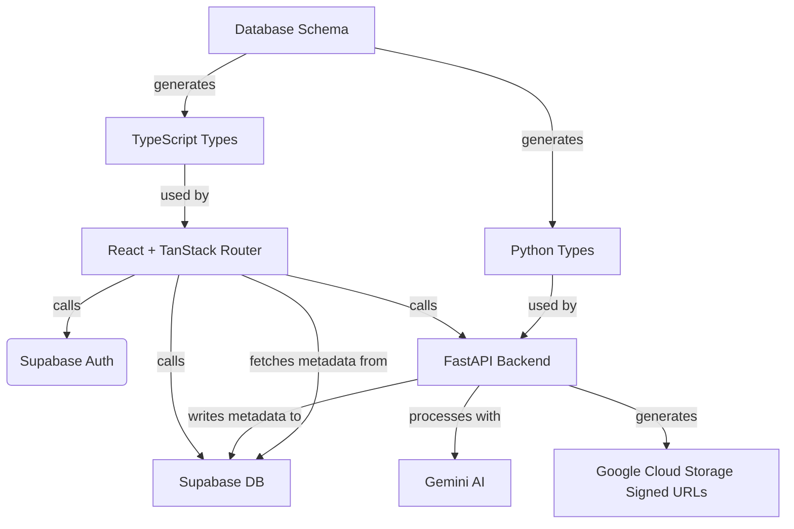
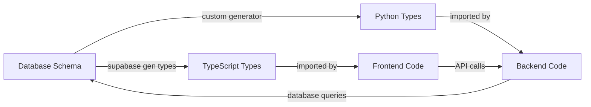

# Echo - AI YouTube Video Metadata Generator

## Table of Contents

1. [Overview](#overview)
2. [Quick Start](#quick-start)
3. [Website](#website)
4. [Architecture](#architecture)
5. [End-to-End Type Safety](#end-to-end-type-safety)
6. [Development Workflow](#development-workflow)
7. [Database & Migrations](#database--migrations)
8. [Supabase Development Rules](#supabase-development-rules)
9. [Environment Configuration](#environment-configuration)
10. [Project Structure](#project-structure)
11. [Development Commands](#development-commands)
12. [Contributing](#contributing)

## Overview

Echo helps users automatically generate metadata for YouTube videos (titles, subtitles, chapters, descriptions) using Google Gemini AI.

### Key Features

- 🎥 **Video Upload & Processing** - Upload videos and get AI-generated metadata
- 🤖 **AI-Powered Analysis** - Uses Google Gemini for transcription and content analysis
- 🔐 **Secure Authentication** - Supabase auth with user data isolation
- ☁️ **Cloud Storage** - Google Cloud Storage for video files
- 📱 **Modern UI** - React frontend with TanStack Router
- 🔒 **End-to-End Type Safety** - Database-driven type generation across the entire stack

## Quick Start

### Prerequisites

- Python 3.10+ with [uv](https://github.com/astral-sh/uv)
- Node.js 18+ with [pnpm](https://pnpm.io/)
- [Supabase CLI](https://supabase.com/docs/guides/cli)
- Docker (for local Supabase)

### Setup

1. **Clone and setup environment:**

```bash
git clone <repository-url>
cd echo
cp .env.example .env
# Edit .env with your configuration
```

2. **Install dependencies:**

```bash
pnpm install
pnpm setup:python-env
```

3. **Start development environment:**

```bash
pnpm dev
```

That's it! This single command starts:

- Local Supabase database
- Python FastAPI backend (port 8000)
- TypeScript frontend (port 3000)

Visit `http://localhost:3000` to access the application.

## Website

The Echo web application is built with modern React and TanStack Router, providing a fast and intuitive user experience for AI-powered video metadata generation.

### Frontend Architecture

- **Framework**: React 18 with TanStack Router for type-safe routing
- **Styling**: Tailwind CSS with shadcn/ui components
- **State Management**: TanStack Query for server state, React hooks for local state
- **Authentication**: Supabase Auth with protected routes and user session management
- **Form Handling**: Unified Auth components with FormData-based submission
- **Error Handling**: Comprehensive error boundaries and user-friendly error messages

### Key Features

- **🔐 Authentication Flow**: Seamless sign-in/sign-up with email and password
- **📁 File Upload**: Drag-and-drop video upload with progress tracking
- **🤖 AI Processing**: Real-time status updates for video analysis jobs
- **📝 Metadata Editing**: Interactive forms for editing AI-generated content
- **📱 Responsive Design**: Mobile-first design that works on all devices
- **⚡ Performance**: Optimized with code splitting and lazy loading

### User Experience

1. **Landing Page** - Clear value proposition and call-to-action
2. **Authentication** - Simple email/password auth with error handling
3. **Dashboard** - Overview of uploaded videos and processing status
4. **Upload Flow** - Intuitive video upload with progress feedback
5. **Results View** - Clean interface for viewing and editing AI-generated metadata
6. **Profile Management** - User settings and account management

### Technical Highlights

- **Type Safety**: End-to-end type safety from database to UI components
- **Error Boundaries**: Graceful error handling with fallback components
- **Route Protection**: Automatic redirects for unauthenticated users
- **Form Validation**: Client-side validation with server-side verification
- **Real-time Updates**: Live status updates for long-running AI processing jobs

### Development Patterns

The website follows modern React patterns adopted from the official TanStack Start + Supabase example:

- **Unified Auth Components**: Single Auth component for both sign-in and sign-up
- **FormData Handling**: Simple form submission without complex state management
- **Server Functions**: Type-safe server functions with consistent error handling
- **Mutation Hooks**: Custom `useMutation` hook for form submissions and API calls
- **Error Handling**: Hybrid approach with redirects for auth and error components for other failures

## Architecture



### Tech Stack

- **Backend**: FastAPI with Python 3.10+ and uv
- **Frontend**: React with TanStack Router
- **Database**: PostgreSQL via Supabase (source of truth for types)
- **Storage**: Google Cloud Storage
- **AI**: Google Gemini
- **Auth**: Supabase Auth
- **Type Safety**: Database-driven type generation for TypeScript and Python

### User Workflow

1. **Upload Video** - User uploads video file through the web interface
2. **Processing** - FastAPI extracts audio and sends to Gemini for analysis
3. **AI Generation** - Gemini generates title, description, transcript, and chapters
4. **Results** - User views and can edit the generated metadata

## End-to-End Type Safety

Echo implements a **database-first type system** where the PostgreSQL schema is the single source of truth for all types across the entire stack.

### The Type Safety Flow



### How It Works

When you want to add new functionality:

1. **Think Database First** - Design the tables and columns you need
2. **Write Migration** - Create a Supabase migration file
3. **Apply Migration** - Run the migration to update your database schema
4. **Generate Types** - Run type generation to update TypeScript and Python types
5. **Use Types** - Import and use the generated types in your code

### Example Workflow

Let's say you want to add video categories:

```bash
# 1. Create migration
cd packages/supabase
supabase migration new add_video_categories

# 2. Write SQL in the generated file
# packages/supabase/migrations/[timestamp]_add_video_categories.sql
```

```sql
-- Add to migration file
BEGIN;

CREATE TABLE public.video_categories (
    id SERIAL PRIMARY KEY,
    name TEXT NOT NULL UNIQUE,
    description TEXT,
    created_at TIMESTAMPTZ DEFAULT timezone('utc'::text, now()) NOT NULL
);

ALTER TABLE public.videos
ADD COLUMN category_id INTEGER REFERENCES public.video_categories(id);

COMMIT;
```

```bash
# 3. Apply migration
pnpm db:push

# 4. Generate types
pnpm gen:types:db

# 5. Use in your code - types are automatically available!
```

**Frontend (TypeScript):**

```typescript
import { VideoCategory, Video } from "@echo/types";

// Types are automatically generated and available
const categories: VideoCategory[] = await supabase
  .from("video_categories")
  .select("*");
```

**Backend (Python):**

```python
from apps.core.types.database import VideoCategory, Video

# Types are automatically generated and available
def get_categories() -> List[VideoCategory]:
    # Implementation here
```

### Type Generation Commands

| Command                         | Purpose                                        |
| ------------------------------- | ---------------------------------------------- |
| `pnpm gen:types:db`             | Generate TypeScript types from database schema |
| `pnpm typecheck`                | Type check all TypeScript code                 |
| `cd apps/core && uv run mypy .` | Type check all Python code                     |

### Benefits

✅ **Single Source of Truth** - Database schema drives all types
✅ **Automatic Consistency** - No type mismatches between frontend/backend
✅ **Catch Errors Early** - Type errors caught at compile time
✅ **Better DX** - IntelliSense and autocomplete everywhere
✅ **Refactoring Safety** - Schema changes propagate automatically
✅ **Documentation** - Types serve as living documentation

## Development Workflow

### Adding New Features

The recommended workflow for adding new functionality:

1. **Design Database Schema** - Think about what tables/columns you need
2. **Create Migration** - Write SQL migration file
3. **Apply Migration** - Update local database
4. **Generate Types** - Update TypeScript and Python types
5. **Implement Backend** - Add API endpoints using generated types
6. **Implement Frontend** - Add UI using generated types
7. **Test** - Verify everything works end-to-end

### Daily Development

```bash
# Start development environment
pnpm dev

# After making database changes
pnpm db:push && pnpm gen:types:db

# Type check everything
pnpm typecheck
cd apps/core && uv run mypy .

# Run tests
pnpm test
```

### Code Quality

- **Type Safety**: All code must pass TypeScript and mypy type checking
- **Linting**: Use provided ESLint and Ruff configurations
- **Testing**: Write tests for new functionality
- **Documentation**: Update docs when adding new features
- **Supabase Rules**: Follow guidelines in `.cursor/rules/sb-*.mdc` for database development

## Database & Migrations

### Database Schema

Echo uses PostgreSQL via Supabase with the following core tables:

| Table            | Purpose                                                   |
| ---------------- | --------------------------------------------------------- |
| `videos`         | Stores uploaded video file information                    |
| `video_jobs`     | Tracks video processing job status                        |
| `video_metadata` | Stores AI-generated metadata (titles, descriptions, etc.) |

### Creating Migrations

1. **Create migration file:**

```bash
cd packages/supabase
supabase migration new descriptive_name
```

2. **Write SQL in the generated file:**

```sql
-- Migration: Add new feature
-- Description: What this migration does

BEGIN;

-- Your SQL changes here
CREATE TABLE public.new_table (
    id SERIAL PRIMARY KEY,
    name TEXT NOT NULL,
    created_at TIMESTAMPTZ DEFAULT timezone('utc'::text, now()) NOT NULL
);

COMMIT;
```

3. **Apply migration:**

```bash
pnpm db:push
```

4. **Generate types:**

```bash
pnpm gen:types:db
```

### Migration Best Practices

- **Always use transactions** - Wrap changes in `BEGIN;` and `COMMIT;`
- **Include rollback instructions** - Comment how to undo changes
- **Test locally first** - Apply to local database before production
- **Use descriptive names** - Make migration purpose clear
- **Handle existing data** - Consider data migration for schema changes

### Development Rules Reference

Echo follows strict Supabase development guidelines documented in `.cursor/rules/sb-*.mdc`. See [Supabase Development Rules](#supabase-development-rules) section for details.

### Row Level Security (RLS)

All tables use RLS to ensure users can only access their own data:

```sql
-- Example: Users can only see their own videos
CREATE POLICY "Users can select their own videos" ON public.videos
FOR SELECT TO authenticated
USING ((SELECT auth.uid()) = uploader_user_id);
```

### Database Commands

| Command             | Purpose                       |
| ------------------- | ----------------------------- |
| `pnpm db:start`     | Start local Supabase          |
| `pnpm db:stop`      | Stop local Supabase           |
| `pnpm db:push`      | Apply migrations to database  |
| `pnpm db:reset`     | Reset database to clean state |
| `pnpm gen:types:db` | Generate types from schema    |

## Supabase Development Rules

Echo follows strict guidelines for Supabase development to ensure security, performance, and consistency. These rules are enforced through our development tooling in `.cursor/rules/`.

### Migration Guidelines (`.cursor/rules/sb-create-migration.mdc`)

#### **File Naming Convention**

- Use format: `YYYYMMDDHHmmss_short_description.sql`
- Example: `20240906123045_create_profiles.sql`

#### **SQL Standards**

- Write all SQL in lowercase
- Include thorough comments explaining purpose and behavior
- Add copious comments for destructive operations
- Include header comment with metadata about the migration

#### **Security Requirements**

- **Always enable RLS** on new tables (even for public access)
- Create granular policies (separate for SELECT, INSERT, UPDATE, DELETE)
- Specify roles explicitly (`authenticated`, `anon`) for each policy
- Include comments explaining rationale for each security policy

### RLS Policy Guidelines (`.cursor/rules/sb-create-rls-policies.mdc`)

#### **Policy Structure**

- **Separate policies** for each operation (SELECT, INSERT, UPDATE, DELETE)
- **Never use `FOR ALL`** - create individual policies instead
- **Role specification** - Always use `TO authenticated` or `TO anon`
- **Descriptive names** - Use clear, detailed policy names in double quotes

#### **Performance Optimization**

- Use `(select auth.uid())` pattern instead of `auth.uid()` directly
- Add indexes on columns used in policy conditions
- Minimize joins in policy expressions
- Prefer `PERMISSIVE` over `RESTRICTIVE` policies

#### **Policy Syntax Rules**

- SELECT policies: Use `USING` clause only
- INSERT policies: Use `WITH CHECK` clause only
- UPDATE policies: Use both `USING` and `WITH CHECK`
- DELETE policies: Use `USING` clause only

### Database Function Guidelines (`.cursor/rules/sb-create-database-functions.mdc`)

#### **Security Defaults**

- **Default to `SECURITY INVOKER`** for safer access control
- Use `SECURITY DEFINER` only when explicitly required
- Always set `search_path = ''` to avoid security risks
- Use fully qualified names (e.g., `public.table_name`)

#### **Function Quality**

- Use explicit input/output types
- Prefer `IMMUTABLE` or `STABLE` over `VOLATILE` when possible
- Include proper error handling with meaningful exceptions
- Minimize side effects - prefer functions that return results

### Example: Complete Migration Following All Rules

```sql
-- Migration: Add video categories
-- Description: Creates categories table with proper RLS policies and indexes
-- Affected: videos table (adds category_id foreign key)
-- Rollback: DROP TABLE public.video_categories; ALTER TABLE public.videos DROP COLUMN category_id;

BEGIN;

-- create categories table
CREATE TABLE public.video_categories (
    id SERIAL PRIMARY KEY,
    name TEXT NOT NULL UNIQUE,
    description TEXT,
    created_at TIMESTAMPTZ DEFAULT timezone('utc'::text, now()) NOT NULL
);

-- enable rls (required for all tables)
ALTER TABLE public.video_categories ENABLE ROW LEVEL SECURITY;

-- separate policies for each operation and role
CREATE POLICY "Categories are viewable by everyone" ON public.video_categories
FOR SELECT TO authenticated, anon
USING (true);

CREATE POLICY "Categories can be created by authenticated users" ON public.video_categories
FOR INSERT TO authenticated
WITH CHECK (true);

CREATE POLICY "Categories can be updated by authenticated users" ON public.video_categories
FOR UPDATE TO authenticated
USING (true)
WITH CHECK (true);

CREATE POLICY "Categories can be deleted by authenticated users" ON public.video_categories
FOR DELETE TO authenticated
USING (true);

-- add foreign key to videos
ALTER TABLE public.videos
ADD COLUMN category_id INTEGER REFERENCES public.video_categories(id);

-- add index for performance (required for foreign keys used in policies)
CREATE INDEX idx_videos_category_id ON public.videos(category_id);

-- insert default categories
INSERT INTO public.video_categories (name, description) VALUES
    ('educational', 'educational content'),
    ('entertainment', 'entertainment content'),
    ('tutorial', 'how-to and tutorial content');

COMMIT;
```

### Rule Enforcement

These rules are automatically enforced through:

- **Cursor IDE rules** - Provide guidance during development
- **Code review** - Manual verification of adherence to guidelines
- **Migration validation** - Check structure and security before deployment

## Environment Configuration

### Required Environment Variables

| Variable                    | Description               | Default |
| --------------------------- | ------------------------- | ------- |
| `SUPABASE_URL`              | Supabase project URL      |         |
| `SUPABASE_ANON_KEY`         | Supabase anonymous key    |         |
| `SUPABASE_SERVICE_ROLE_KEY` | Supabase service role key |         |
| `GEMINI_API_KEY`            | Google Gemini AI API key  |         |

### Optional Environment Variables

| Variable                         | Description                        | Default          |
| -------------------------------- | ---------------------------------- | ---------------- |
| `ENVIRONMENT`                    | Development/production environment | `development`    |
| `STORAGE_BACKEND`                | Storage backend (`local` or `gcs`) | `local`          |
| `LOCAL_STORAGE_PATH`             | Path for local file storage        | `./output_files` |
| `GCS_BUCKET_NAME`                | Google Cloud Storage bucket name   |                  |
| `GOOGLE_APPLICATION_CREDENTIALS` | Path to GCP credentials JSON       |                  |
| `REDIS_URL`                      | Redis connection URL for caching   |                  |

### Environment Setup

1. Copy the example environment file:

```bash
cp .env.example .env
```

2. Fill in the required variables:

```bash
# Supabase (required)
SUPABASE_URL=your_supabase_url
SUPABASE_ANON_KEY=your_anon_key
SUPABASE_SERVICE_ROLE_KEY=your_service_role_key

# AI (required)
GEMINI_API_KEY=your_gemini_api_key

# Storage (optional - defaults to local)
STORAGE_BACKEND=local
LOCAL_STORAGE_PATH=./output_files
```

## Project Structure

```
echo/
├── apps/
│   ├── core/                    # FastAPI Backend (Python)
│   │   ├── api/                 # API endpoints
│   │   ├── services/            # Business logic
│   │   ├── lib/                 # Utilities and adapters
│   │   └── types/               # Generated Python types
│   └── web/                     # React Frontend (TypeScript)
│       ├── app/                 # Application code
│       ├── components/          # Reusable components
│       └── types/               # Generated TypeScript types
├── packages/
│   ├── supabase/               # Database configuration
│   │   ├── migrations/         # SQL migration files
│   │   └── types/              # Generated database types
│   └── types/                  # Unified type system
│       └── src/                # Type definitions and exports
├── scripts/                    # Build and utility scripts
├── docs/                       # Documentation (if needed)
├── DATABASE.md                 # Database schema reference
└── README.md                   # Main documentation (this file)
```

## Development Commands

### Essential Commands

| Command      | Purpose                              |
| ------------ | ------------------------------------ |
| `pnpm dev`   | Start entire development environment |
| `pnpm build` | Build all applications               |
| `pnpm test`  | Run all tests and quality checks     |

### Database Operations

| Command         | Purpose                       |
| --------------- | ----------------------------- |
| `pnpm db:start` | Start local Supabase          |
| `pnpm db:stop`  | Stop local Supabase           |
| `pnpm db:push`  | Apply migrations to database  |
| `pnpm db:reset` | Reset database to clean state |

### Type Generation

| Command                         | Purpose                             |
| ------------------------------- | ----------------------------------- |
| `pnpm gen:types:db`             | Generate types from database schema |
| `pnpm typecheck`                | Type check all TypeScript code      |
| `cd apps/core && uv run mypy .` | Type check all Python code          |

### Quality Checks

| Command       | Purpose                 |
| ------------- | ----------------------- |
| `pnpm lint`   | Lint all applications   |
| `pnpm format` | Format all applications |
| `pnpm check`  | Run all quality checks  |

### Targeted Development

| Command         | Purpose       |
| --------------- | ------------- |
| `pnpm dev:web`  | Frontend only |
| `pnpm dev:core` | Backend only  |

## Contributing

### Development Guidelines

1. **Database First** - Always start with database schema design
2. **Type Safety** - All code must pass type checking
3. **Supabase Rules** - Follow guidelines in `.cursor/rules/sb-*.mdc` for all database work
4. **Testing** - Write tests for new functionality
5. **Documentation** - Update docs when adding features

### Pull Request Process

1. Create feature branch from `main`
2. Make your changes following the database-first workflow
3. Run quality checks: `pnpm typecheck && pnpm lint && pnpm test`
4. Update documentation if needed
5. Submit pull request with clear description

### Code Quality Standards

- **TypeScript**: Must pass `pnpm typecheck`
- **Python**: Must pass `uv run mypy .` in `apps/core`
- **Linting**: Must pass `pnpm lint`
- **Testing**: New features must include tests

## License

[Add your license information here]
