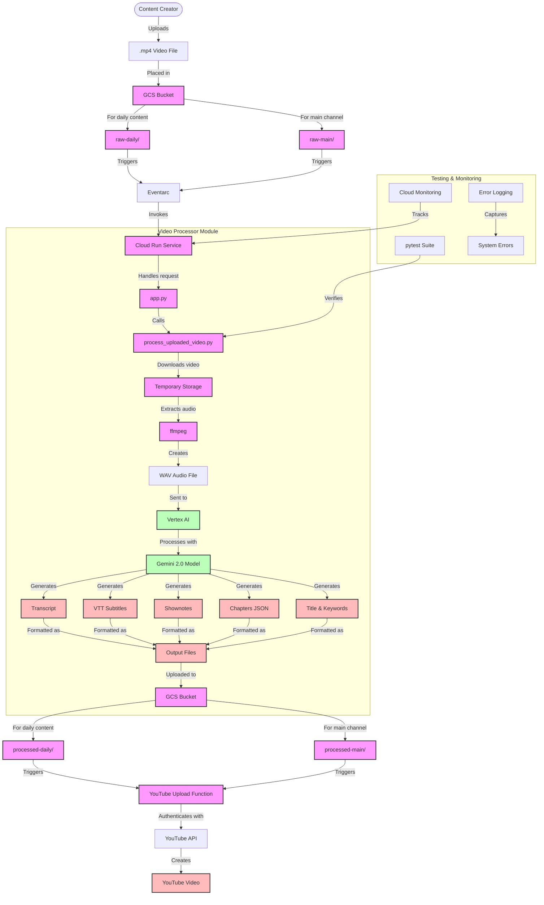
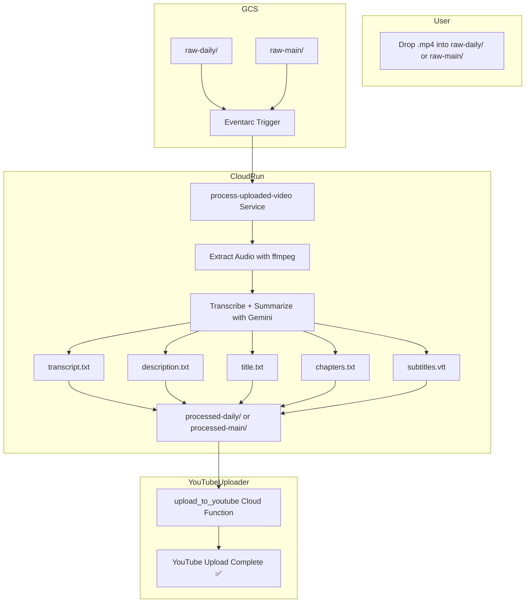
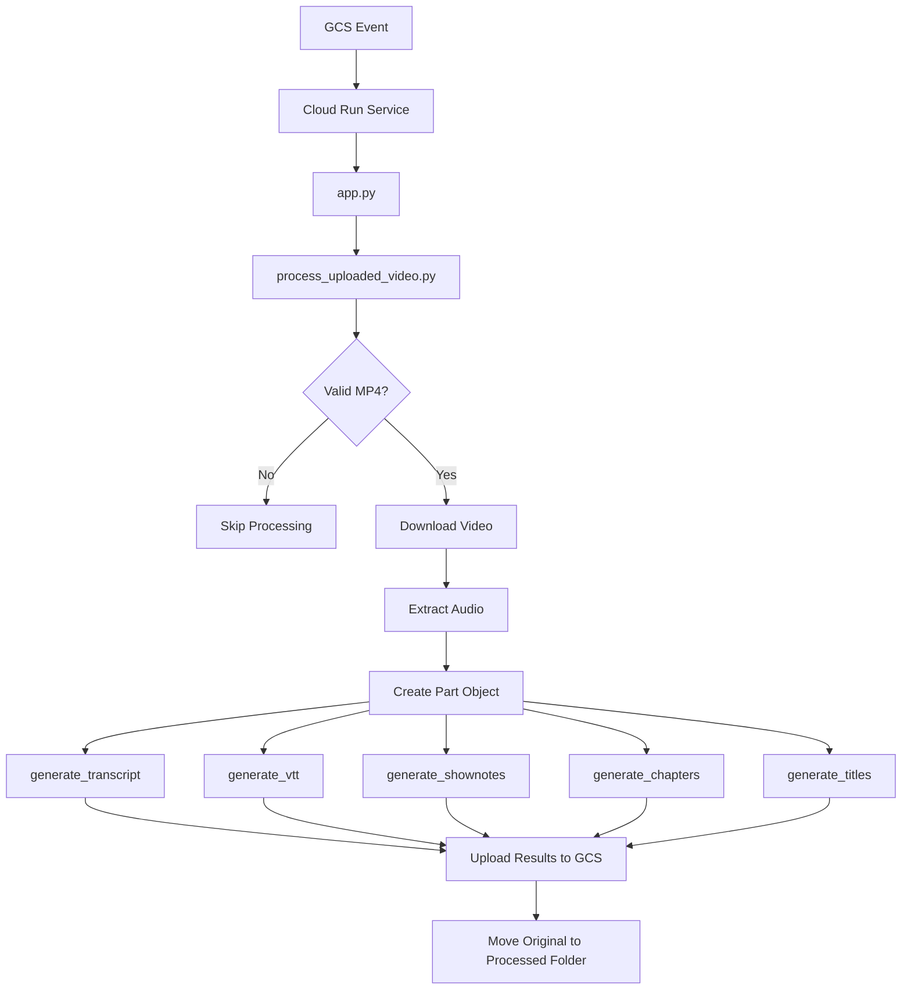
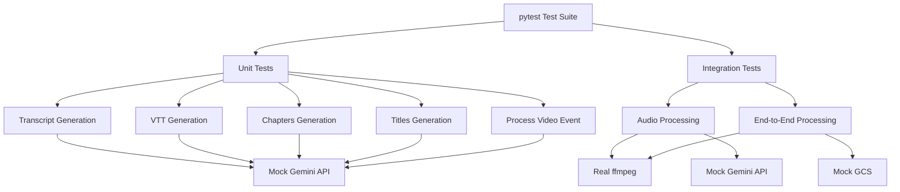

# 🎬 Video Upload + AI Metadata Pipeline

This repo powers the automation pipeline for uploading `.mp4` files to YouTube with AI-generated transcripts, titles, chapters, and descriptions — using Google Cloud Run + Gemini via Vertex AI.

## 🌟 Project Overview

The Video Upload + AI Metadata Pipeline automates the process of preparing video content for YouTube. It takes raw video files, processes them using AI to generate high-quality metadata, and prepares them for upload to YouTube. This system dramatically reduces the manual work involved in video publishing while ensuring consistent, high-quality metadata.

### Key Features

- **Automated Video Processing**: Upload videos to GCS buckets and trigger automatic processing
- **AI-Generated Metadata**: Generate transcripts, titles, descriptions, and chapters using Gemini AI
- **Flexible Processing Paths**: Support for both daily content and main channel content
- **Comprehensive Testing**: Robust test suite for reliable operation
- **Scalable Architecture**: Cloud-native design that scales with your content needs

---
## Deployment Workflows

There are two primary ways to deploy this application to Cloud Run:

**1. Direct Source Deployment (Current Method):**

This is the simplest method for quick deployments directly from your local source code. Google Cloud Build handles the container building and pushing behind the scenes.

-   **Command:** `gcloud run deploy process-uploaded-video --source . --region <your-region>`
-   **Pros:** Simple, fewer manual steps.
-   **Cons:** Less control over the build process, can potentially lead to architecture mismatches (like the `exec format error` if building on ARM and deploying to x86) if not careful.

```mermaid
flowchart TD
    subgraph "Local Development"
        A[📝 Code (main.py, etc.)] --> B(📄 Dockerfile);
        C[📋 requirements.txt] --> B;
    end

    subgraph "Google Cloud Build (Triggered by gcloud run deploy --source)"
        A & B & C -- gcloud run deploy --source . --> D[Builds Image];
        D --> E[Pushes to Ephemeral Registry];
    end

    subgraph "Google Cloud Run"
        E -- Implicitly --> F[🚀 Cloud Run Service];
        F -- Pulls Image & Runs --> G[🏃 Container Instance(s)];
    end

    G --> H[👂 Listens for Events (e.g., GCS Upload)];
```

**2. Build & Push to Artifact Registry (Recommended):**

This method gives you more control, ensures architecture compatibility, and is the standard for production environments.

1.  **`Dockerfile` (Blueprint):** Defines how to build the container image.
2.  **`docker buildx build --platform linux/amd64 ... --push` (Factory & Delivery):** Builds the image specifically for Cloud Run's `linux/amd64` architecture and pushes it to Artifact Registry.
3.  **Artifact Registry (Warehouse):** Stores your versioned Docker images.
4.  **`gcloud run deploy --image ...` (Runner):** Tells Cloud Run to pull a specific image tag from Artifact Registry and run it.

```mermaid
flowchart TD
    subgraph "Local Development"
        AA[📝 Code (main.py, etc.)] --> BB(📄 Dockerfile);
        CC[📋 requirements.txt] --> BB;
        BB -- docker buildx build --platform linux/amd64 --> DD[📦 Docker Image (amd64)];
    end

    subgraph "Google Cloud"
        DD -- docker push --> EE[🏪 Artifact Registry];
        EE -- gcloud run deploy --image --> FF[🚀 Cloud Run Service];
        FF -- Pulls Image & Runs --> GG[🏃 Container Instance(s)];
    end

    GG --> HH[👂 Listens for Events (e.g., GCS Upload)];

    AA --> CC;
```

**Important Note: CPU Architecture Mismatch (ARM64 vs. AMD64)**

-   **The Problem:** Google Cloud Run instances typically use the `linux/amd64` (also known as x86_64) CPU architecture. However, modern Macs with Apple Silicon (M1/M2/M3) use the `linux/arm64` (or aarch64) architecture.
-   **The Error:** If you build a Docker image *without* specifying the platform on an ARM-based Mac, Docker defaults to building an `arm64` image. Trying to run this `arm64` image on Cloud Run's `amd64` environment results in an `exec format error` because the underlying operating system doesn't understand the compiled code's instruction set.
-   **Workflow A Solution:** The `docker buildx build --platform linux/amd64 ...` command explicitly tells Docker (even on your ARM Mac) to cross-compile and build the image for the `linux/amd64` architecture that Cloud Run requires. This guarantees compatibility.
-   **Workflow B Caveat:** While `gcloud run deploy --source .` usually lets Cloud Build handle this correctly behind the scenes, subtle build environment issues can sometimes occur. Using Workflow A (Build & Push) provides more direct control and was used in this project's troubleshooting to definitively resolve the `exec format error`.

## Original Workflow Diagram (GCS -> Cloud Run -> Processing -> YouTube)

```mermaid
flowchart TD
  A[📤 Upload .mp4 to raw-daily/ or raw-main/] --> B[🗂️ GCS Bucket]

  B --> C[🔔 Eventarc Trigger]
  C --> D[🚀 Cloud Run (process-uploaded-video)]

  D --> E[📥 app.py handles POST /]
  E --> F[🧠 process_uploaded_video.py]

  F --> G[🔊 Extract audio via ffmpeg]
  G --> H[🤖 Gemini (Vertex AI)
transcript + metadata]

  H --> I[📂 processed-daily/ or processed-main/
transcript.txt, title.txt, etc.]

  I --> J[⬆️ Upload to YouTube (via Cloud Function)]
```


## 🧠 Architecture Overview

### Complete System Architecture



### Core Processing Flow



### Video Processor Module Detail



---

## 🔧 Components

### Core Components

| Component                   | Description                                            |
| --------------------------- | ------------------------------------------------------ |
| `process_uploaded_video.py` | Core module that extracts audio and uses Gemini        |
| `app.py`                    | Cloud Run service entry point for handling GCS events  |
| `Dockerfile`                | Custom container to support ffmpeg and Vertex          |
| Eventarc trigger            | Links GCS uploads to Cloud Run                         |
| Vertex AI (Gemini 2.0)      | Handles transcription, title generation, and summaries |

### Video Processor Module

The `video_processor/` directory contains a modular implementation of the video processing functionality:

| Component                                   | Description                                           |
| ------------------------------------------- | ----------------------------------------------------- |
| `video_processor/process_uploaded_video.py` | Core module for video processing and AI integration   |
| `video_processor/app.py`                    | Cloud Run service entry point                         |
| `video_processor/tests/`                    | Comprehensive test suite for all functionality        |
| `video_processor/README.md`                 | Detailed documentation for the video processor module |

### Testing Framework

The project includes a comprehensive testing framework to ensure reliability:

| Component                                           | Description                               |
| --------------------------------------------------- | ----------------------------------------- |
| `video_processor/tests/conftest.py`                 | Common pytest fixtures for testing        |
| `video_processor/tests/test_*_generation.py`        | Unit tests for each generation function   |
| `video_processor/tests/test_process_video_event.py` | Tests for the main processing function    |
| `video_processor/test_audio_processing.py`          | Standalone test for audio processing      |
| `video_processor/test_process_video.py`             | Standalone test for end-to-end processing |

---

## 🐛 Recent Bug Fixes & Improvements

### Audio Format for Gemini API

We recently fixed an issue where raw binary WAV audio data was being passed directly to the Gemini API, which expects a properly formatted Part object with the correct MIME type.

#### Problem
The error occurred when trying to process audio data with Gemini API:
```
ERROR:root:Gemini API call failed: Unexpected item type: b'RIFF\xf0j=\x00WAVEfmt \x10\x00\x00\x00\x01\x00\x01\x00\x80>\x00\x00\x00}\x00\x00\x02\x00\x10\x00LIST\x1a\x00\x00\x00INFOISFT\x0e\x00\x00\x00Lavf59.27.100\x00data\xaaj=\x00...
```

#### Solution
1. Modified the code to use the `Part.from_data()` method to properly format the audio data with the correct MIME type
2. Updated all Gemini API functions to accept the properly formatted audio part
3. Fixed environment variable issues by using hardcoded project ID instead of relying on environment variables
4. Added comprehensive test suite to prevent similar issues in the future

### Comprehensive Test Suite

We've added a robust test suite to ensure the reliability of the video processing pipeline:

1. **Unit Tests:** Tests for each generation function in isolation
2. **Integration Tests:** Tests for the end-to-end processing workflow
3. **Mocking:** Proper mocking of external dependencies like Vertex AI and GCS
4. **Documentation:** Detailed documentation on how to run tests and what to look for

See the `video_processor/README.md` file for more details on the testing framework.

---

## 🔜 Next Automations (Ranked by Impact vs Effort)

| Priority | Automation                    | Impact | Effort | Description                                       |
| -------- | ----------------------------- | ------ | ------ | ------------------------------------------------- |
| 1        | Skool Post Generator          | ⭐⭐⭐⭐   | ⭐⭐     | Auto-post insights to Skool based on video output |
| 2        | Daily AI News Video Generator | ⭐⭐⭐⭐   | ⭐⭐⭐    | Scrape top AI stories → script + upload           |
| 3        | YouTube Comment Q&A Generator | ⭐⭐⭐    | ⭐⭐     | Pull top comments, answer via Gemini              |
| 4        | AI Strategy Devlog Generator  | ⭐⭐⭐    | ⭐⭐⭐    | Summarize weekly building efforts as content      |
| 5        | 3-Part AI Agent Series        | ⭐⭐⭐⭐⭐  | ⭐⭐⭐⭐⭐  | Fully written/recorded video series on agents     |

---

## 📝 Usage & Expected Outcomes

1.  **Upload:** Drop your `.mp4` video file into the GCS bucket under either the `raw-daily/` or `raw-main/` prefix.
2.  **Trigger:** An Eventarc trigger detects the new file and invokes the `process-uploaded-video` Cloud Run service.
3.  **Processing:**
    *   Cloud Run downloads the video.
    *   `ffmpeg` extracts the audio into a `.wav` file.
    *   The audio is sent to Gemini (Vertex AI) for processing.
    *   Gemini returns the transcript, description, titles, and chapters.
4.  **Output:** The service writes the following files back to the GCS bucket under the corresponding `processed-daily/<video-name>/` or `processed-main/<video-name>/` prefix:
    *   `transcript.txt`: Full text transcript of the video.
    *   `description.txt`: A short, engaging YouTube description.
    *   `title.txt`: 3 suggested clickbaity titles.
    *   `chapters.txt`: Timestamped chapters for the video.
5.  **YouTube Upload (Future):** A separate Cloud Function (not yet implemented in this repo, see *Next Automations*) is intended to monitor the `processed-*` prefixes, retrieve the generated text files, and use them to upload the original video to YouTube.

---

## 🧪 Testing Framework

The project includes a comprehensive testing framework to ensure reliability and maintainability. The testing approach combines unit tests, integration tests, and standalone test scripts.

### Testing Architecture



### Implemented Tests

1. **Unit Tests (`pytest`):**
   * Tests for each generation function in isolation:
     * `test_transcript_generation.py`
     * `test_vtt_generation.py`
     * `test_chapters_generation.py`
     * `test_titles_generation.py`
   * Tests for the main processing function:
     * `test_process_video_event.py`
   * **Mocking:** Uses `unittest.mock` to mock external dependencies:
     * `google.cloud.storage`: Mocks `storage.Client`, `bucket`, and `blob` interactions
     * `vertexai`: Mocks `GenerativeModel` and its `generate_content` method
     * `subprocess.run`: Mocks the `ffmpeg` call
   * **Test Cases:**
     * Normal operation with valid inputs
     * Edge cases with unusual inputs
     * Error handling for API failures
     * Handling of non-MP4 files or files in wrong directories

2. **Standalone Test Scripts:**
   * `test_audio_processing.py`: Tests audio extraction and processing with Gemini API
   * `test_process_video.py`: Tests the end-to-end video processing workflow

### Running Tests

```bash
# Navigate to the video_processor directory
cd video_processor

# Install test dependencies
pip install pytest pytest-mock pytest-cov

# Run all tests with coverage report
pytest

# Run specific test file
pytest tests/test_transcript_generation.py

# Run tests with verbose output
pytest -v

# Run tests with coverage report
pytest --cov=. --cov-report=term-missing
```

### Common Testing Issues and Solutions

See the `video_processor/README.md` file for detailed information on common testing issues and solutions, including:

1. Mocking Vertex AI Part objects
2. Handling newline characters in tests
3. Patching the correct import paths
4. Debugging test failures

---

## 🚀 CI/CD Setup (GitHub Actions)

A GitHub Actions workflow (`.github/workflows/deploy.yml`) can automate testing and deployment:

1.  **Trigger:** On push/merge to the `main` branch.

2.  **Jobs:**
    *   **`lint`:**
        *   Checkout code.
        *   Set up Python.
        *   Install dependencies (`requirements.txt`).
        *   Run linters (`flake8`, `black --check`).
    *   **`test`:**
        *   Checkout code.
        *   Set up Python.
        *   Install dependencies.
        *   Run unit tests (`pytest tests/`).
    *   **`build_and_deploy` (depends on `lint`, `test`):**
        *   Checkout code.
        *   Authenticate to Google Cloud (using Workload Identity Federation or Service Account Key secret).
        *   Configure Docker for Artifact Registry (`gcloud auth configure-docker ...`).
        *   Build multi-platform image using `docker buildx build --platform linux/amd64 ...` and push to Artifact Registry with a unique tag (e.g., Git SHA).
        *   Deploy to Cloud Run using the newly pushed image tag (`gcloud run deploy ... --image <artifact-registry-path>:<tag> ...`).

3.  **Secrets:** Store GCP service account keys or Workload Identity Federation configuration securely in GitHub repository secrets.

```mermaid
flowchart TD
    A[Push to main branch] --> B{GitHub Actions Trigger};
    B --> C[Lint Job];
    B --> D[Test Job];
    C --> E{Build & Deploy Job};
    D --> E;
    E --> F[Auth to GCP];
    F --> G[Configure Docker];
    G --> H[Build & Push Image (linux/amd64)];
    H --> I[Deploy to Cloud Run];
```

This setup ensures that code is automatically tested and deployed only if checks pass, preventing broken deployments and enabling safer collaboration.

