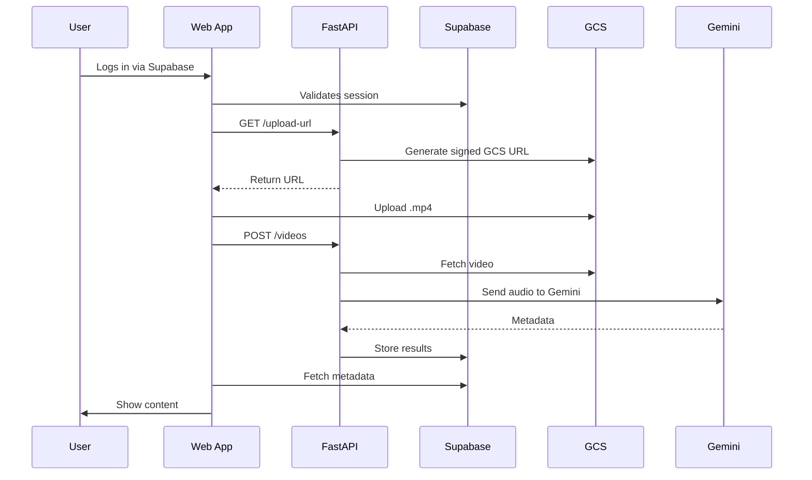

# AI YouTube Video Metadata Generator — PRD

## ✨ Overview

This app helps users automatically generate metadata for YouTube videos (titles, subtitles, chapters, descriptions) using Google Gemini.

It uses a polyglot monorepo architecture with:

* Supabase for auth, database, and real-time features
* FastAPI for AI workflows and video processing
* GCS for video storage
* React + TanStack for frontend UI and routing

---

## 🛠️ Stack Architecture

```mermaid
graph TD
  A[React + TanStack Router] -->|calls| B(Supabase Auth)
  A -->|calls| C[FastAPI Backend]
  A -->|calls| D[Supabase DB]
  C -->|generates| E[Google Cloud Storage Signed URLs]
  C -->|processes with| F[Gemini (via Vertex AI)]
  C -->|writes metadata to| D
  A -->|fetches metadata from| D
```

---

## 📖 Key Use Cases

### 1. User Onboarding

* Login/signup via Supabase
* Connect YouTube account (OAuth)

### 2. Upload Video

* Get signed GCS upload URL from FastAPI
* Upload video directly to GCS
* Trigger FastAPI to process video

### 3. Generate Metadata

* FastAPI extracts audio
* Sends audio to Gemini
* Saves results (transcript, title, description, chapters) to Supabase

### 4. View Results

* React frontend fetches metadata via Supabase
* User sees structured AI-generated content

---

## 📝 API Endpoints

| Endpoint         | Method   | Description                               |
| ---------------- | -------- | ----------------------------------------- |
| `/auth/login`    | POST     | Custom auth endpoint if needed            |
| `/upload-url`    | POST     | Returns signed GCS upload URL             |
| `/videos`        | POST     | Logs video metadata + triggers processing |
| `/videos/:id`    | GET      | Returns generated metadata                |
| `/youtube/oauth` | GET/POST | Handles YouTube OAuth                     |

---

## 📊 Data Models

### `users`

* `id`
* `email`
* `youtube_access_token`
* `created_at`

### `videos`

* `id`
* `user_id`
* `gcs_path`
* `processing_status`
* `created_at`

### `video_metadata`

* `id`
* `video_id`
* `title`
* `description`
* `transcript`
* `chapters`
* `updated_at`

---

## 👌 Frontend Responsibilities

* Supabase SDK handles auth and session
* React fetches signed URLs from FastAPI
* Video uploaded directly to GCS
* API call to FastAPI to trigger metadata processing
* Polls FastAPI for metadata or queries Supabase

---

## ⚖️ Backend Responsibilities

* FastAPI routes for file handling, auth, AI logic
* Generates signed URLs
* Integrates with Gemini via Vertex AI
* Persists results in Supabase
* Background jobs for long-running tasks (via asyncio or Celery)

---

## 🚀 DevOps

* Docker Compose for local dev + prod
* Traefik reverse proxy for HTTPS
* GitHub Actions for CI/CD

---

## 🔒 Security

* Supabase handles RLS and auth
* GCS uploads via signed URLs
* JWT auth between frontend and FastAPI
* OAuth token refresh support

---

## 📊 Testing

* Pytest for FastAPI endpoints
* Playwright for frontend E2E tests
* Supabase seeding for test environments

---

## 🔄 Workflow Diagram



---

## 💻 Development Setup

### Generating API Types

To ensure type consistency between the Python backend (`apps/core`) Pydantic models and the TypeScript frontend (`apps/web`), we use `pydantic-to-typescript`.

-   **Pydantic Models Location**: `apps/core/api/schemas/video_processing_schemas.py`
-   **Generated TypeScript Types Location**: `apps/web/src/types/api.ts`

To regenerate the TypeScript types after making changes to the Pydantic models, run the following command from the `apps/web` directory:

```bash
pnpm run generate:api-types
```

This script executes `pydantic2ts` using the `uv` environment from `apps/core`.

Make sure you have installed the necessary dependencies:
-   In `apps/core` (Python environment, managed by `uv`):
    ```bash
    # If not already installed (should be via pyproject.toml or uv.lock)
    # cd apps/core && uv add "pydantic-to-typescript>=2"
    ```
-   In `apps/web` (Node.js environment, managed by `pnpm`):
    ```bash
    # If not already installed (should be via package.json)
    # pnpm --filter @echo/web add -D json-schema-to-typescript 
    ```

---

This structure lets you move fast, use Supabase where it shines, and lean into Python where AI or Google SDKs are best. Let me know if you want to split this PRD into feature cards or set up tracking in Linear/Notion.
