# 🎬 Video Upload + AI Metadata Pipeline

This repo powers the automation pipeline for uploading `.mp4` files to YouTube with AI-generated transcripts, titles, chapters, and descriptions — using Google Cloud Run + Gemini via Vertex AI.

## 🌟 Project Overview

The Video Upload + AI Metadata Pipeline automates the process of preparing video content for YouTube. It takes raw video files, processes them using AI to generate high-quality metadata, and uploads them to YouTube. This system dramatically reduces the manual work involved in video publishing while ensuring consistent, high-quality metadata.

### Key Features

- **Automated Video Processing**: Upload videos to GCS buckets and trigger automatic processing
- **AI-Generated Metadata**: Generate transcripts, titles, descriptions, and chapters using Gemini AI
- **Flexible Processing Paths**: Support for both daily content and main channel content
- **YouTube Integration**: Automatic upload to YouTube with proper metadata and captions
- **Comprehensive Testing**: Robust test suite for reliable operation
- **Scalable Architecture**: Cloud-native design that scales with your content needs

## 🚀 Getting Started

### Prerequisites

Before you begin, make sure you have the following installed:

1. **Python 3.9+**: Required for running the application
2. **Docker**: Required for containerization and testing
3. **Google Cloud SDK**: Required for deployment and authentication
4. **Git**: Required for version control

### Setup

1. **Clone the repository**
   ```bash
   git clone https://github.com/yourusername/Automations.git
   cd Automations
   ```

2. **Create a virtual environment**
   ```bash
   python -m venv venv
   source venv/bin/activate  # On Windows: venv\Scripts\activate
   ```

3. **Install dependencies**
   ```bash
   pip install -r requirements.txt
   ```

4. **Set up Google Cloud credentials**
   ```bash
   # Copy your service account key to the credentials directory
   mkdir -p credentials
   cp /path/to/your/service-account-key.json credentials/service_account.json

   # Set environment variable
   export GOOGLE_APPLICATION_CREDENTIALS="$(pwd)/credentials/service_account.json"
   ```

## 💻 Development Workflow

### Project Structure

The project is organized as follows:

```
Automations/
├── video_processor/       # Main application code
├── scripts/               # Utility scripts
├── test_data/             # Test data directory
├── docs/                  # Documentation
├── Dockerfile             # Container definition
├── docker-compose.yml     # Docker Compose configuration
├── requirements.txt       # Python dependencies
└── deploy.sh              # Deployment script
```

For a detailed explanation of the project structure, see [PROJECT_STRUCTURE.md](docs/PROJECT_STRUCTURE.md).

### Making Changes

1. **Understand the code**: Start by reading the code in the `video_processor` directory
2. **Make your changes**: Edit the relevant files
3. **Test your changes**: Run the tests as described in the Testing section
4. **Commit your changes**: Use descriptive commit messages


## 📊 System Architecture

```mermaid
flowchart TD
  A[📤 Upload .mp4 to daily-raw/ or main-raw/] --> B[🗂️ GCS Bucket: automations-youtube-videos-2025]

  B --> C[🔔 Eventarc Trigger: video-processor-trigger]
  C --> D[🚀 Cloud Run Service: video-processor in us-east1]

  D --> E[📥 app.py handles POST /]
  E --> F[🧠 process_uploaded_video.py]

  F --> G[🔊 Extract audio via ffmpeg]
  G --> H[🤖 Gemini API: gemini-2.0-flash-001]

  H --> I[📂 processed-daily/ or processed-main/]

  I --> J[🔔 Eventarc Trigger]
  J --> K[⬆️ YouTube Upload]
```



## 🧪 Testing

We have several methods for testing the application. Choose the one that best fits your needs:

### Method 1: Quick Python Testing

This is the simplest method and doesn't require Docker.

```bash
# Make the script executable (only needed once)
chmod +x scripts/test_locally.py

# Run the test
python scripts/test_locally.py --file test-video.mp4 --run-server
```

**What to look for:**
- The Flask app should start successfully
- You should see "Response status code: 204" (indicates success)
- You should see "Successfully processed gs://automations-videos/test-video.mp4"

### Method 2: Docker-based Testing (Recommended)

This method provides a more comprehensive test using Docker containers.

```bash
# Make the script executable (only needed once)
chmod +x scripts/docker_test.sh

# Run the test
./scripts/docker_test.sh --clean
```

**What to look for:**
- The test should complete with "✅ Test passed! All outputs were generated correctly."
- You should see content previews for each output file
- The test should end with "Test completed successfully!"

### Method 3: Testing with Real API Calls

Use this method when you want to see the actual outputs from the Gemini API.

```bash
# Make the script executable (only needed once)
chmod +x scripts/real_api_test.py

# Run the test
python scripts/real_api_test.py --clean
```

**What to look for:**
- The test should complete with "Video processing completed successfully!"
- You should see actual content in the transcript, subtitles, and other outputs
- There should be no error messages

**Note:** This method uses real API calls and requires proper Google Cloud authentication.

### Examining Test Outputs

After running any of the tests, you can find the output files in the `test_data/processed-daily/` directory. The outputs include:

- **transcript.txt**: Full text transcript of the video
- **subtitles.vtt**: WebVTT format subtitles with timestamps
- **shownotes.txt**: Markdown-formatted show notes
- **chapters.txt**: Timestamped chapters for the video
- **title.txt**: Generated title for the video

For more detailed testing instructions, see the [Testing Guide](docs/TESTING_GUIDE.md).

## 🚀 Deployment

Deploying the application to Google Cloud is straightforward:

### Step 1: Prepare for Deployment

Make sure you have the necessary permissions and have authenticated with Google Cloud:

```bash
# Authenticate with Google Cloud
gcloud auth login

# Set the project ID
gcloud config set project automations-457120
```

### Step 2: Deploy the Application

Use the deployment script to deploy the application:

```bash
# Make the script executable (only needed once)
chmod +x deploy.sh

# Run the deployment script
./deploy.sh
```

**What to look for:**
- The script should run tests, build the Docker image, and deploy to Cloud Run
- You should see "Deployment completed successfully!" at the end
- The script will output the URL of the deployed service

### Step 3: Test the Deployment

After deployment, you can test the application by uploading a video to the GCS bucket:

```bash
# Upload a video to the GCS bucket
gsutil cp test_data/test-video.mp4 gs://automations-youtube-videos-2025/daily-raw/
```

### Step 4: Monitor the Deployment

You can monitor the application using Cloud Run logs:

```bash
# View the logs
gcloud logging read 'resource.type=cloud_run_revision AND resource.labels.service_name=video-processor AND resource.labels.location=us-east1' \
  --limit=10 \
  --format='table(timestamp, severity, textPayload)'
```

### Troubleshooting Deployment

If you encounter issues during deployment:

1. Check the deployment logs for error messages
2. Verify that your service account has the necessary permissions
3. Make sure your GCS bucket exists and is accessible
4. Try running the deployment with the `--verbose` flag for more detailed output

For more detailed deployment instructions, see the [Deployment Guide](docs/DEPLOYMENT_GUIDE.md).


## 📚 Additional Documentation

For more detailed information about the project, refer to the following documentation:

1. **[Project Structure Guide](docs/PROJECT_STRUCTURE.md)**: Detailed explanation of the project structure
2. **[Testing Guide](docs/TESTING_GUIDE.md)**: Comprehensive testing instructions
3. **[Visual Testing Guide](docs/VISUAL_TESTING_GUIDE.md)**: Visual examples of what to expect during testing
4. **[Quick Test Guide](docs/QUICK_TEST_GUIDE.md)**: Simple step-by-step instructions for quick testing
5. **[Monitoring Guide](docs/MONITORING_GUIDE.md)**: Guide for monitoring the application in production

---

## 📝 Usage & Expected Outcomes

1.  **Upload:** Drop your `.mp4` video file into the GCS bucket `automations-youtube-videos-2025`.
2.  **Trigger:** The Eventarc trigger detects the new file and invokes the `video-processor` Cloud Run service.
3.  **Processing:**
    *   Cloud Run downloads the video.
    *   `ffmpeg` extracts the audio into a `.wav` file.
    *   The audio is sent to Gemini (Vertex AI) for processing.
    *   Gemini returns the transcript, description, titles, and chapters.
4.  **Output:** The service writes the following files back to the GCS bucket:
    *   `transcript.txt`: Full text transcript of the video.
    *   `description.txt`: A short, engaging YouTube description.
    *   `title.txt`: Suggested clickbaity title.
    *   `chapters.txt`: Timestamped chapters for the video.
    *   `subtitles.vtt`: WebVTT format subtitles with timestamps.
5.  **YouTube Upload:** The service uploads the video to YouTube with the generated metadata and captions using the integrated YouTube uploader module.

---

## 🧪 Testing Framework

The project includes a comprehensive testing framework to ensure reliability and maintainability. The testing approach combines unit tests, integration tests, and standalone test scripts.

### 📚 Testing Documentation

We've created detailed testing guides to help developers of all experience levels:

1. **[Quick Test Guide](docs/QUICK_TEST_GUIDE.md)**: Simple step-by-step instructions for quick testing
2. **[Comprehensive Testing Guide](docs/TESTING_GUIDE.md)**: Detailed instructions for all testing scenarios
3. **[Visual Testing Guide](docs/VISUAL_TESTING_GUIDE.md)**: Visual examples of what to expect during testing
4. **[Local Testing Guide](docs/LOCAL_TESTING.md)**: Guide for testing the application locally

### Testing Architecture


### Implemented Tests

1. **Unit Tests (`pytest`):**
   * Tests for each generation function in isolation:
     * `test_transcript_generation.py`
     * `test_vtt_generation.py`
     * `test_chapters_generation.py`
     * `test_titles_generation.py`
   * Tests for the main processing function:
     * `test_process_video_event.py`
   * Tests for the main application:
     * `test_main.py`: Tests the Flask app and event handling
   * Tests for YouTube integration:
     * `test_youtube_uploader.py`: Tests YouTube upload functionality
     * `test_generate_youtube_token.py`: Tests OAuth token generation
   * **Mocking:** Uses `unittest.mock` to mock external dependencies:
     * `google.cloud.storage`: Mocks `storage.Client`, `bucket`, and `blob` interactions
     * `vertexai`: Mocks `GenerativeModel` and its `generate_content` method
     * `subprocess.run`: Mocks the `ffmpeg` call
     * `google.oauth2.credentials`: Mocks YouTube API credentials
     * `googleapiclient.discovery`: Mocks YouTube API service
     * `google.cloud.secretmanager`: Mocks Secret Manager client
   * **Test Cases:**
     * Normal operation with valid inputs
     * Edge cases with unusual inputs
     * Error handling for API failures
     * Handling of non-MP4 files or files in wrong directories
     * YouTube upload success and failure scenarios
     * OAuth token generation and storage

2. **Standalone Test Scripts:**
   * `test_audio_processing.py`: Tests audio extraction and processing with Gemini API
   * `test_process_video.py`: Tests the end-to-end video processing workflow

---

## 📚 Usage & Expected Outcomes

1.  **Upload:** Drop your `.mp4` video file into the GCS bucket `automations-youtube-videos-2025`.
2.  **Trigger:** The Eventarc trigger detects the new file and invokes the `video-processor` Cloud Run service.
3.  **Processing:**
    *   Cloud Run downloads the video.
    *   `ffmpeg` extracts the audio into a `.wav` file.
    *   The audio is sent to Gemini (Vertex AI) for processing.
    *   Gemini returns the transcript, description, titles, and chapters.
4.  **Output:** The service writes the following files back to the GCS bucket:
    *   `transcript.txt`: Full text transcript of the video.
    *   `description.txt`: A short, engaging YouTube description.
    *   `title.txt`: Suggested clickbaity title.
    *   `chapters.txt`: Timestamped chapters for the video.
    *   `subtitles.vtt`: WebVTT format subtitles with timestamps.
5.  **YouTube Upload:** The service uploads the video to YouTube with the generated metadata and captions using the integrated YouTube uploader module.

## 🚀 YouTube Uploader Enhancements

The YouTube uploader module can be enhanced with additional features to provide more control over video uploads. Below is an analysis of potential enhancements with ICE scores (Impact, Confidence, Ease) to help prioritize implementation.

| Enhancement                      | Description                                                             | Impact (1-10) | Confidence (1-10) | Ease (1-10) | ICE Score | Priority |
| -------------------------------- | ----------------------------------------------------------------------- | ------------- | ----------------- | ----------- | --------- | -------- |
| **Privacy Status Options**       | Change default from "private" to "unlisted" or add configuration option | 9             | 10                | 10          | 900       | 1        |
| **Keywords/Tags Implementation** | Extract or generate SEO keywords for videos                             | 8             | 8                 | 7           | 448       | 2        |
| **Custom Thumbnails**            | Support uploading custom thumbnail images                               | 9             | 9                 | 6           | 486       | 3        |
| **Playlists Integration**        | Add videos to playlists automatically                                   | 7             | 8                 | 7           | 392       | 4        |
| **Scheduled Publishing**         | Set videos to publish at specific dates/times                           | 8             | 7                 | 6           | 336       | 5        |
| **Video Language Settings**      | Specify video language and add localized metadata                       | 6             | 8                 | 5           | 240       | 6        |
| **Content Rating**               | Add content rating information to videos                                | 5             | 9                 | 8           | 360       | 7        |
| **Advanced Metadata**            | Support for location, recording date, etc.                              | 6             | 7                 | 5           | 210       | 8        |

### Implementation Details

#### 1. Privacy Status Options (ICE: 900)

Currently, videos are set to "private" by default. This enhancement would:
- Add environment variable or configuration option to set default privacy status
- Support "unlisted" as the preferred default for most use cases
- Allow per-video privacy settings via metadata files

#### 2. Keywords/Tags Implementation (ICE: 448)

Currently, no keywords/tags are added to videos. This enhancement would:
- Support a keywords.txt file for explicit keyword lists
- Extract keywords from title and description if no explicit list is provided
- Optionally generate SEO-optimized keywords using AI

#### 3. Custom Thumbnails (ICE: 486)

Currently, YouTube generates automatic thumbnails. This enhancement would:
- Support uploading custom thumbnail images (JPG, PNG)
- Detect thumbnail files in the processed folder
- Apply thumbnails after successful video upload

#### 4. Playlists Integration (ICE: 392)

Currently, videos are not added to playlists. This enhancement would:
- Support playlist.txt file to specify playlist IDs
- Add videos to specified playlists after upload
- Support creating new playlists if needed

#### 5. Scheduled Publishing (ICE: 336)

Currently, videos are published immediately with the specified privacy setting. This enhancement would:
- Support schedule.txt file with ISO 8601 date format
- Set videos to private until the scheduled date
- Automatically change privacy status at the scheduled time

#### 6. Video Language Settings (ICE: 240)

Currently, no language metadata is specified. This enhancement would:
- Support language specification in metadata
- Add defaultLanguage parameter to video uploads
- Support localized titles and descriptions

#### 7. Content Rating (ICE: 360)

Currently, no content rating is specified. This enhancement would:
- Support content rating specification in metadata
- Add contentRating parameter to video uploads
- Provide guidance on appropriate content ratings

#### 8. Advanced Metadata (ICE: 210)

Currently, only basic metadata is supported. This enhancement would:
- Support additional metadata like location, recording date, etc.
- Add support for JSON-based metadata configuration
- Provide more control over video metadata
