# 🎬 Video Upload + AI Metadata Pipeline

This repo powers the automation pipeline for uploading `.mp4` files to YouTube with AI-generated transcripts, titles, chapters, and descriptions — using Google Cloud Run + Gemini via Vertex AI.

## 🌟 Project Overview

The Video Upload + AI Metadata Pipeline automates the process of preparing video content for YouTube. It takes raw video files, processes them using AI to generate high-quality metadata, and uploads them to YouTube. This system dramatically reduces the manual work involved in video publishing while ensuring consistent, high-quality metadata.

### Key Features

- **Automated Video Processing**: Upload videos to GCS buckets and trigger automatic processing
- **AI-Generated Metadata**: Generate transcripts, titles, descriptions, and chapters using Gemini AI
- **Enhanced Frontend UI**: Modern interface with real-time processing status, title selection, and thumbnail management
- **Flexible Processing Paths**: Support for both daily content and main channel content
- **YouTube Integration**: Automatic upload to YouTube with proper metadata and captions
- **Real-time Feedback**: Visual progress tracking for all processing stages with ProgressSteps component
- **Collaborative Content Management**: Title voting system and thumbnail selection gallery
- **Comprehensive Testing**: Robust test suite for reliable operation
- **Scalable Architecture**: Cloud-native design that scales with your content needs

## 🚀 Getting Started

### Prerequisites

Before you begin, make sure you have the following installed:

1. **Docker and Docker Compose**: Required for containerized development and testing
2. **Google Cloud SDK**: Required for deployment and authentication
3. **Git**: Required for version control

### Setup

1. **Clone the repository**
   ```bash
   git clone https://github.com/yourusername/Automations.git
   cd Automations
   ```

2. **Set up Google Cloud credentials**
   ```bash
   # Copy your service account key to the @credentials directory
   mkdir -p @credentials
   cp /path/to/your/service-account-key.json @credentials/service_account.json
   ```

3. **Make Docker scripts executable**
   ```bash
   chmod +x docker-start.sh docker-stop.sh docker-logs.sh docker-test.sh
   ```

## 💻 Development Environment

We've improved our development workflow with easy-to-use scripts that manage both Docker containers and local development.

### Docker Development Workflow (Recommended)

We use Docker to provide a consistent development environment that matches production. This is the recommended approach for all developers.


#### Starting the Services

Start both frontend and backend services with a single command:

```bash
./docker-start.sh
```

This will:
- Start the Python backend on port 8080
- Start the React frontend on port 3000
- Mount your local directories for real-time development

**Options:**
- Rebuild containers: `./docker-start.sh --rebuild`
- Include mock GCS for testing: `./docker-start.sh --with-mock`

#### Viewing Logs

View logs from all services:

```bash
./docker-logs.sh
```

**Options:**
- View specific service logs: `./docker-logs.sh --service backend`
- View logs without following: `./docker-logs.sh --no-follow`

#### Stopping Services

Stop all services when you're done:

```bash
./docker-stop.sh
```

**Options:**
- Remove containers: `./docker-stop.sh --remove`

#### Running Tests

Run integration tests using Docker:

```bash
./docker-test.sh
```

**Options:**
- Clean test directories: `./docker-test.sh --clean`
- Use a specific video file: `./docker-test.sh --video "my-test-video.mp4"`

#### Monitoring Services

For deployed services, use our monitoring tool:

```bash
./monitor-services.sh
```

This interactive dashboard shows:
- Cloud Run service status across regions
- Recent logs and request counts
- Eventarc triggers
- GCS bucket contents

### Service Management Features

Our service management scripts provide several key features:

1. **Consistent Environment**: The same Docker setup works for all developers
2. **Hot Reloading**: Frontend and backend code changes are detected automatically
3. **Firestore Integration**: Real-time database updates in development
4. **API Proxying**: Frontend requests are automatically forwarded to the backend
5. **Isolated Testing**: Test environment with mock services
6. **Comprehensive Monitoring**: Real-time logs and status information

See [Docker Setup](docs/DOCKER_SETUP.md) for more detailed instructions.

### Project Structure

The project is organized for clarity and maintainability, with a clear separation between frontend and backend code:

```mermaid
flowchart TD
    Root[Automations/] --> Frontend[frontend/]
    Root --> Backend[backend/]
    Root --> Docs[docs/]
    Root --> Creds[@credentials/]
    Root --> Docker[Docker Files]
    
    Frontend --> FComponents[components/]
    Frontend --> FRoutes[routes/]
    Frontend --> FDockerfile[Dockerfile]
    
    FComponents --> UIComp[ui/]
    FComponents --> VideoComp[video/]
    FComponents --> SharedComp[shared/]
    FComponents --> HomeComp[home/]
    
    VideoComp --> ProgressSteps[progress-steps.tsx]
    VideoComp --> VideoProgress[video-progress-card.tsx]
    VideoComp --> ProcessingDash[processing-dashboard.tsx]
    VideoComp --> ContentEdit[content-editor.tsx]
    VideoComp --> TitleSel[title-selector.tsx]
    VideoComp --> ThumbGallery[thumbnail-gallery.tsx]
    VideoComp --> VideoDetail[video-detail.tsx]
    
    Backend --> BProcessor[video_processor/]
    Backend --> BScripts[scripts/]
    Backend --> BTests[tests/]
    Backend --> BData[test_data/]
    Backend --> BDockerfile[Dockerfile]
    
    Docker --> DockerCompose[docker-compose.yml]
    Docker --> DockerScripts[docker-*.sh scripts]
    
    BProcessor --> Api[api/]
    BProcessor --> Core[core/]
    BProcessor --> Services[services/]
    BProcessor --> Utils[utils/]
```

## 📊 System Architecture

The complete system architecture is shown below:


### Data Flow


## 🧪 Testing

We have several methods for testing the application:

### Integrated Docker Testing (Recommended)

Our new Docker setup makes testing simple:

```bash
./docker-test.sh
```

This will:
1. Start all services including mock GCS
2. Send a test video for processing
3. Verify that all outputs are generated correctly

### Examining Test Outputs

After running the test, you'll find these outputs in the test directory:
- **transcript.txt**: Full text transcript
- **subtitles.vtt**: WebVTT format subtitles
- **chapters.txt**: Timestamped chapters
- **title.txt**: Generated title

### Testing Architecture

```mermaid
flowchart TD
    A[docker-test.sh] --> B[Start Containers]
    B --> C[Process Test Video]
    C --> D[Verify Outputs]
    D --> E{All Files Generated?}
    E -->|Yes| F[Test Passed ✅]
    E -->|No| G[Test Failed ❌]
```



For more detailed testing instructions, see the [Testing Guide](docs/TESTING_GUIDE.md) or [Docker Setup](docs/DOCKER_SETUP.md).

## 🚀 Deployment

Deploying the application to Google Cloud:

```bash
# Authenticate with Google Cloud
gcloud auth login

# Set the project ID
gcloud config set project automations-457120

# Deploy using GitHub Actions
git push origin master
```

Our GitHub Actions workflow will:
1. Run tests
2. Build Docker images
3. Deploy the backend to Cloud Run
4. Deploy the frontend to Firebase

### Deployment Flow


## 📚 Additional Documentation

For more detailed information about the project, refer to the following documentation:

1. **[Docker Setup](docs/DOCKER_SETUP.md)**: Guide for using the Docker development environment
2. **[Project Structure Guide](docs/PROJECT_STRUCTURE.md)**: Detailed explanation of the project structure
3. **[Testing Guide](docs/TESTING_GUIDE.md)**: Comprehensive testing instructions
4. **[Monitoring Guide](docs/MONITORING_GUIDE.md)**: Guide for monitoring the application in production

---

## 📝 Usage & Expected Outcomes

### Frontend User Flow

1. **Upload:** Use the Upload page to drag-and-drop your `.mp4` file or select it from your computer.
   * The ProgressSteps component shows real-time upload progress
   * File is uploaded directly to GCS using a secure signed URL
   * A Firestore document is created to track the video's processing status

2. **Processing Dashboard:** Monitor your video's processing progress in real-time.
   * The ProcessingDashboard component shows all videos currently in processing
   * VideoProgressCard components display each video's current stage and progress
   * Firestore real-time updates ensure the UI always reflects the current status

3. **Video Details:** Once processing completes, view and manage your video's content.
   * Browse to the Video Detail page to see all generated content
   * Use the tabbed interface to navigate between Overview, Title, Thumbnail, and Metadata
   * Use TitleSelector to vote on and select the best AI-generated title
   * Use ThumbnailGallery to preview and choose from multiple AI-generated thumbnails
   * Use ContentEditor to review and edit transcript, chapters, and other content

4. **YouTube Management:** Manage your YouTube settings and monitor the upload process.
   * Review your video before publishing to YouTube
   * Control publication date, privacy settings, and other YouTube-specific options
   * Track YouTube upload status with real-time updates

### Backend Processing Flow

1. **Trigger:** When a video is uploaded to GCS or a Firestore document is updated, the appropriate processing is triggered.

2. **Processing:**
   * Cloud Run downloads the video
   * `ffmpeg` extracts the audio into a `.wav` file
   * The audio is sent to Gemini (Vertex AI) for processing
   * Gemini returns the transcript, description, titles, and chapters
   * Multiple thumbnail options are generated

3. **Output:** The service writes the following files back to GCS:
   * `transcript.txt`: Full text transcript of the video
   * `description.txt`: A short, engaging YouTube description
   * `titles.json`: Multiple suggested title options
   * `chapters.txt`: Timestamped chapters for the video
   * `subtitles.vtt`: WebVTT format subtitles with timestamps
   * `thumbnails/`: Directory containing multiple AI-generated thumbnail options

4. **Firestore Updates:** Processing status and metadata are continuously updated in Firestore.
   * Real-time status updates trigger UI refreshes via onSnapshot
   * Generated content is referenced and loaded from GCS when needed

5. **YouTube Upload:** The service uploads the video to YouTube with the selected metadata and captions.