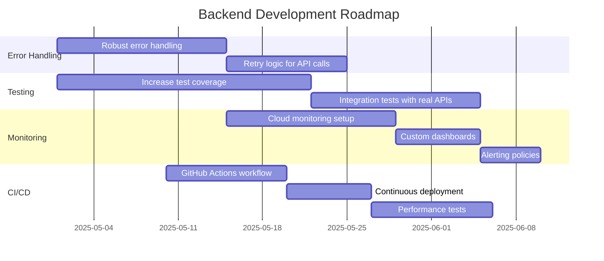
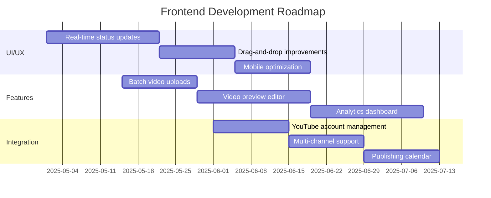
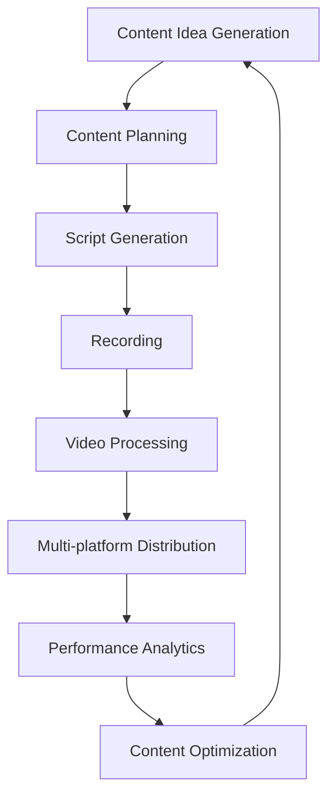

# 🔜 Video Upload + AI Metadata Pipeline Roadmap

This document outlines the planned features and improvements for the Video Upload + AI Metadata Pipeline project. Features are prioritized using ICE scoring (Impact, Confidence, Ease) to help focus development efforts.

## 🌟 YouTube Uploader Enhancements

We've prioritized YouTube uploader enhancements using ICE scoring (scale 1-10 for each factor):

| Enhancement                      | Description                                                             | Impact | Confidence | Ease | ICE Score | Priority |
| -------------------------------- | ----------------------------------------------------------------------- | ------ | ---------- | ---- | --------- | -------- |
| **Privacy Status Options**       | Change default from "private" to "unlisted" or add configuration option | 9      | 10         | 10   | 900       | 1        |
| **Keywords/Tags Implementation** | Extract or generate SEO keywords for videos                             | 8      | 8          | 7    | 448       | 2        |
| **Custom Thumbnails**            | Support uploading custom thumbnail images                               | 9      | 9          | 6    | 486       | 3        |
| **Playlists Integration**        | Add videos to playlists automatically                                   | 7      | 8          | 7    | 392       | 4        |
| **Scheduled Publishing**         | Set videos to publish at specific dates/times                           | 8      | 7          | 6    | 336       | 5        |
| **Video Language Settings**      | Specify video language and add localized metadata                       | 6      | 8          | 5    | 240       | 6        |
| **Content Rating**               | Add content rating information to videos                                | 5      | 9          | 8    | 360       | 7        |
| **Advanced Metadata**            | Support for location, recording date, etc.                              | 6      | 7          | 5    | 210       | 8        |
| **Auto-Comments**                | Automatically add and pin comments from my account                      | 7      | 8          | 6    | 336       | 9        |
| **VidIQ Title Generator**        | Generate 10 title options using VidIQ logic with Discord notifications  | 9      | 7          | 4    | 252       | 10       |
| **Pillo Thumbnail Generator**    | Generate 4 thumbnails using custom Pillo workflow                       | 9      | 6          | 3    | 162       | 11       |

### Implementation Details

#### 1. Privacy Status Options (ICE: 900) ✅
- Add environment variable or configuration option to set default privacy status
- Support "unlisted" as the preferred default for most use cases
- Allow per-video privacy settings via metadata files

#### 2. Keywords/Tags Implementation (ICE: 448)
- Support a keywords.txt file for explicit keyword lists
- Extract keywords from title and description if no explicit list is provided
- Optionally generate SEO-optimized keywords using AI

#### 3. Custom Thumbnails (ICE: 486)
- Support uploading custom thumbnail images (JPG, PNG)
- Detect thumbnail files in the processed folder
- Apply thumbnails after successful video upload

#### 4. Playlists Integration (ICE: 392)
- Support playlist.txt file to specify playlist IDs
- Add videos to specified playlists after upload
- Support creating new playlists if needed

#### 5. Scheduled Publishing (ICE: 336)
- Support schedule.txt file with ISO 8601 date format
- Set videos to private until the scheduled date
- Automatically change privacy status at the scheduled time

#### 6. Video Language Settings (ICE: 240)
- Support language specification in metadata
- Add defaultLanguage parameter to video uploads
- Support localized titles and descriptions

## 📊 Content Creation Pipelines

| Priority | Feature                       | Impact | Confidence | Ease | ICE Score | Description                                       |
| -------- | ----------------------------- | ------ | ---------- | ---- | --------- | ------------------------------------------------- |
| 1        | Skool Post Generator          | 9      | 8          | 7    | 504       | Auto-post insights to Skool based on video output |
| 2        | Daily AI News Video Generator | 9      | 7          | 5    | 315       | Scrape top AI stories → script + upload           |
| 3        | YouTube Comment Q&A Generator | 8      | 8          | 7    | 448       | Pull top comments, answer via Gemini              |
| 4        | AI Strategy Devlog Generator  | 7      | 7          | 6    | 294       | Summarize weekly building efforts as content      |
| 5        | 3-Part AI Agent Series        | 10     | 8          | 4    | 320       | Fully written/recorded video series on agents     |

## 🔧 Technical Improvements

### Backend Infrastructure

1. Add robust error handling for different types of audio files and formats
2. Implement retry logic for API calls to Gemini and other services
3. Increase test coverage for edge cases and error conditions
4. Optimize audio extraction parameters for better quality
5. Add support for additional audio formats

### Frontend Improvements

1. Implement real-time status updates using Firestore listeners
2. Add batch video upload capabilities
3. Create a video preview editor for titles, descriptions, and thumbnails
4. Build an analytics dashboard for tracking video performance
5. Add support for managing multiple YouTube channels

### Cloud Infrastructure

1. **Implement Comprehensive Monitoring (HIGH PRIORITY)**
   - Configure CPU, memory, and request latency monitoring for Cloud Run services
   - Create uptime checks to verify service availability
   - Set up custom log-based metrics to track processing success rates and times
   - Configure alerting policies for service outages and high error rates
   - Build custom dashboards for operational insights and debugging

2. **Cost Optimization**
   - Implement caching strategies to reduce API calls
   - Optimize Cloud Run instances for cost and performance
   - Set up budget alerts and cost tracking

3. **Security Enhancements**
   - Implement fine-grained IAM permissions
   - Add API authentication for frontend-backend communication
   - Secure storage of API keys and credentials

## 🚀 Long-term Vision

The long-term vision for this project is to create a fully automated content creation and distribution pipeline that can:

1. **Generate ideas** for content based on trending topics and audience interests
2. **Create scripts and outlines** using AI based on those ideas
3. **Record and edit videos** with minimal human intervention
4. **Process and upload videos** with optimized metadata across multiple platforms
5. **Promote content** across social media and other channels
6. **Analyze performance** and adjust strategy accordingly

This roadmap will be updated regularly as features are implemented and new priorities emerge.