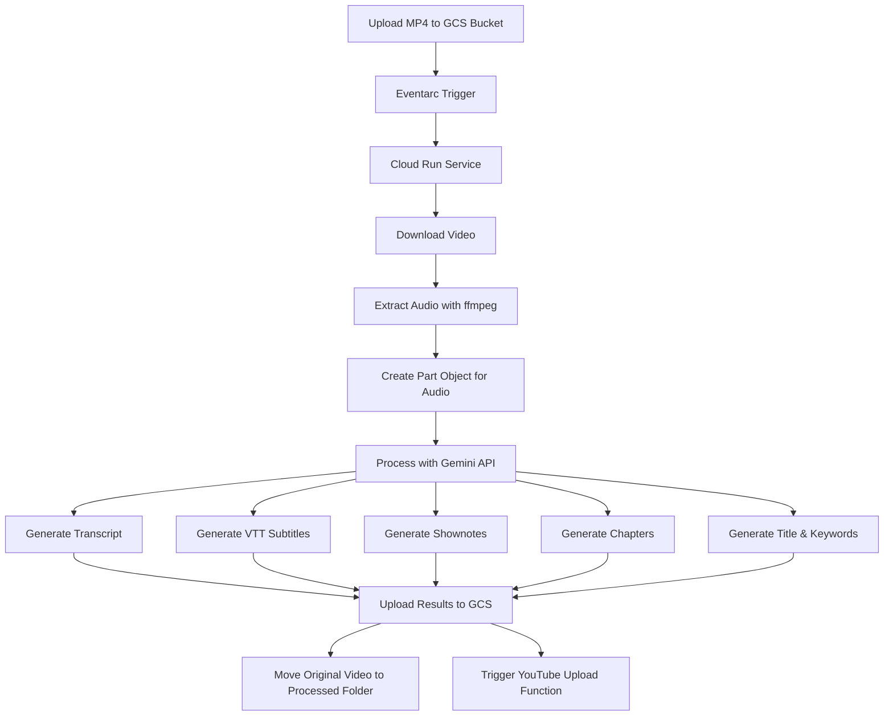

# Video Processor Service

A modular service for processing videos, extracting audio, generating transcripts, subtitles, and more with AI-powered features.

## Project Structure

The project follows a modular architecture design to improve maintainability, testability, and developer experience:

```
backend/video_processor/
├── api/                  # API endpoints and controllers
├── config/               # Configuration management
├── core/                 # Core domain logic
│   ├── models/           # Domain models
│   └── processors/       # Processing components
├── services/             # External service integrations
│   ├── ai/               # AI model integrations
│   ├── storage/          # Storage service (GCS, local)
│   └── youtube/          # YouTube API integration
├── utils/                # Shared utilities
└── tests/                # Tests organized by type
    ├── unit/             # Unit tests
    ├── integration/      # Integration tests
    └── e2e/              # End-to-end tests
```

## Architecture Overview



## Key Design Features

1. **Dependency Injection**
   - Services and components receive dependencies rather than creating them
   - Improves testability and flexibility

2. **Interface-Based Design**
   - Components work with interfaces instead of concrete implementations
   - Enables easy swapping of implementations (e.g., GCS vs. local storage)

3. **Centralized Configuration**
   - Environment variables managed through dedicated system
   - Default values and validation in one place

4. **Error Handling**
   - Consistent error handling with custom exceptions
   - Retry mechanisms for transient failures

5. **Logging**
   - Structured logging throughout the application
   - Consistent format and levels

## Development Workflow

### Local Development

1. Set up your environment:

```bash
# Create a virtual environment
python -m venv venv
source venv/bin/activate

# Install dependencies
pip install -r requirements.txt

# Set environment variables for local testing
export TESTING_MODE=true
export LOCAL_OUTPUT=true
```

2. Run the service locally:

```bash
python -m video_processor.app
```

3. Test a video upload:
   - Use the `scripts/simulate_firestore_update.py` script, or
   - Make a POST request to the service

### Running Tests

Tests are organized by type:

```bash
# Run unit tests
pytest tests/unit

# Run integration tests
pytest tests/integration

# Run end-to-end tests
pytest tests/e2e

# Run comprehensive test
python scripts/run_comprehensive_test.py
```

## Deployment

The service can be deployed to Google Cloud Run:

```bash
# Deploy to Cloud Run
./deploy.sh

# Deploy in dry-run mode (no actual deployment)
./deploy.sh --dry-run

# Skip tests during deployment
./deploy.sh --skip-tests
```

## Service Components

### Storage Service

The `StorageService` interface abstracts storage operations, with implementations for:

- **GCSStorageService**: Google Cloud Storage
- **LocalStorageService**: Local filesystem (for testing and development)

### Video Processing

The core processing pipeline:

1. **Download Video**: Get video from storage
2. **Extract Audio**: Convert video to audio
3. **Generate Transcript**: Create full transcript
4. **Generate Subtitles**: Create subtitles in VTT format
5. **Generate Shownotes**: Create detailed notes
6. **Generate Chapters**: Create timestamped chapters
7. **Generate Title/Keywords**: Create optimized metadata
8. **Upload Results**: Store all outputs

### YouTube Integration

Handles automatic uploading to YouTube channels:

- Authentication using OAuth2
- Separate channel configurations
- Caption and metadata management

## API Integration

### Gemini API

The module uses Google's Gemini API through Vertex AI to process audio and generate various metadata:

1. **Transcript**: Full text transcript of the audio
2. **VTT Subtitles**: WebVTT format subtitles with timestamps
3. **Shownotes**: Detailed notes about the content
4. **Chapters**: Timestamped chapters with summaries
5. **Title & Keywords**: Engaging title and relevant keywords

### Audio Format Requirements

When sending audio to Gemini API:
- Use the `Part.from_data()` method to create a properly formatted Part object
- Specify the correct MIME type (e.g., "audio/wav")
- The audio should be in a supported format (WAV, MP3, etc.)

## Future Improvements

1. Add more robust error handling for different types of audio files and formats
2. Implement retry logic for API calls
3. Increase test coverage for edge cases and error conditions
4. Consider adding support for additional audio formats
5. Optimize audio extraction parameters for better quality
6. Add integration tests with actual GCS and Gemini API (using test credentials)
7. Implement CI/CD pipeline for automated testing
8. Add performance tests to measure processing time for different file sizes
9. Create a test data generator for creating test audio/video files with known content