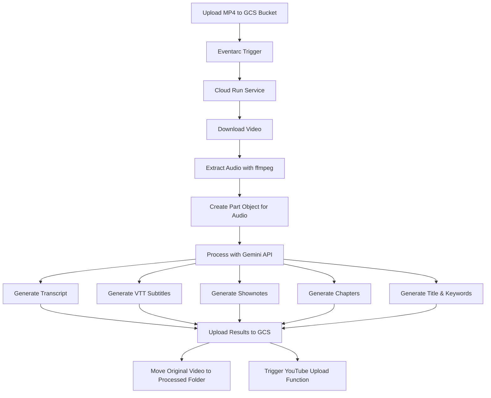
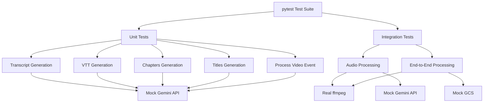

# Video Processor Module

This module handles the processing of uploaded videos, extracting audio, and generating AI-powered metadata using Google's Gemini API.

## Architecture Overview



## Files Overview

### Core Files
- **process_uploaded_video.py**: Core module that handles video processing, audio extraction, and Gemini API integration
- **main.py**: Cloud Run service entry point that receives GCS events and calls the processing functions
- **app.py**: Flask application for the video processor service
- **youtube_uploader.py**: Cloud Function for uploading videos to YouTube
- **generate_youtube_token.py**: Utility for generating YouTube API OAuth tokens

### Test Files
- **tests/**: Directory containing all pytest test files
  - **conftest.py**: Common pytest fixtures for testing
  - **test_transcript_generation.py**: Tests for transcript generation functionality
  - **test_vtt_generation.py**: Tests for VTT subtitles generation
  - **test_chapters_generation.py**: Tests for chapters generation
  - **test_titles_generation.py**: Tests for title and keywords generation
  - **test_process_video_event.py**: Tests for the main process_video_event function
  - **test_main.py**: Tests for the Flask app and event handling
  - **test_youtube_uploader.py**: Tests for YouTube upload functionality
  - **test_generate_youtube_token.py**: Tests for OAuth token generation
- **test_audio_processing.py**: Standalone script for testing audio processing with Gemini API
- **test_process_video.py**: Standalone script for testing the end-to-end video processing workflow
- **pytest.ini**: Configuration file for pytest

## Debugging and Testing

### Recent Bug Fix: Audio Format for Gemini API

We recently fixed an issue where raw binary WAV audio data was being passed directly to the Gemini API, which expects a properly formatted Part object with the correct MIME type.

#### Problem
The error occurred when trying to process audio data with Gemini API:
```
ERROR:root:Gemini API call failed: Unexpected item type: b'RIFF\xf0j=\x00WAVEfmt \x10\x00\x00\x00\x01\x00\x01\x00\x80>\x00\x00\x00}\x00\x00\x02\x00\x10\x00LIST\x1a\x00\x00\x00INFOISFT\x0e\x00\x00\x00Lavf59.27.100\x00data\xaaj=\x00...
```

#### Solution
1. Modified the code to use the `Part.from_data()` method to properly format the audio data with the correct MIME type
2. Updated all Gemini API functions to accept the properly formatted audio part
3. Fixed environment variable issues by using hardcoded project ID instead of relying on environment variables

## Testing Framework

### Overview

We use pytest as our primary testing framework, with additional support from pytest-mock and pytest-cov for mocking and code coverage analysis. Our testing approach includes both unit tests and integration tests.



### Test Directory Structure

```
video_processor/
├── tests/
│   ├── __init__.py                    # Makes tests a proper package
│   ├── conftest.py                    # Common pytest fixtures
│   ├── test_transcript_generation.py  # Tests for transcript generation
│   ├── test_vtt_generation.py         # Tests for VTT generation
│   ├── test_chapters_generation.py    # Tests for chapters generation
│   ├── test_titles_generation.py      # Tests for title generation
│   ├── test_process_video_event.py    # Tests for video processing
│   ├── test_main.py                   # Tests for Flask app and event handling
│   ├── test_youtube_uploader.py       # Tests for YouTube upload functionality
│   └── test_generate_youtube_token.py # Tests for OAuth token generation
├── test_audio_processing.py           # Standalone test script
├── test_process_video.py              # Standalone test script
└── pytest.ini                         # pytest configuration
```

### Setting Up the Test Environment

1. **Install Dependencies**:

```bash
# Install the required packages for testing
pip install pytest pytest-mock pytest-cov

# Or install all requirements including test dependencies
pip install -r requirements.txt
```

2. **Configure Environment Variables** (if needed for integration tests):

```bash
export PROJECT_ID="your-gcp-project-id"
export REGION="us-central1"
```

### Running the Tests

#### Unit Tests with pytest

To run the unit tests with pytest:

```bash
# Navigate to the video_processor directory
cd video_processor

# Run all tests with coverage report
pytest

# Run specific test file
pytest tests/test_transcript_generation.py

# Run tests with specific markers
pytest -m "not integration"

# Run tests with verbose output
pytest -v

# Run tests with coverage report
pytest --cov=. --cov-report=term-missing
```

#### Standalone Test Scripts

We also provide standalone test scripts for quick testing:

```bash
# Test audio processing
python test_audio_processing.py

# Test video processing
python test_process_video.py
```

### What to Look For

When running the tests, pay attention to:

1. **Test Coverage**: Ensure all functions have adequate test coverage (aim for >80%)
2. **Failed Tests**: Any failed tests should be addressed immediately
3. **Warnings**: Address any deprecation warnings or other issues
4. **Mock Verification**: Ensure that mocks are being called with the expected parameters
5. **Edge Cases**: Check that tests cover various edge cases and error conditions

### Testability Improvements

We've made several improvements to make the code more testable:

#### 1. Dependency Injection

The `main.py` module now uses dependency injection to make it easier to test:

```python
def create_app(process_func: Optional[Callable] = None) -> Flask:
    """Create and configure the Flask application."""
    flask_app = Flask(__name__)

    # Use the provided process function or default to the real one
    video_processor = process_func if process_func is not None else process_video_event

    # ... rest of the function
```

This allows tests to inject a mock processing function instead of the real one.

#### 2. Modular Structure

The code is now organized in a modular structure with clear separation of concerns:

- **main.py**: Handles HTTP requests and routing
- **process_uploaded_video.py**: Contains the core processing logic
- **youtube_uploader.py**: Handles YouTube API integration
- **generate_youtube_token.py**: Manages OAuth token generation

This makes it easier to test each component in isolation.

### Common Testing Issues and Solutions

#### 1. Mocking Vertex AI Part Objects

When mocking Vertex AI Part objects, use `MagicMock(spec=Part)` to ensure the mock behaves like a real Part object:

```python
from vertexai.preview.generative_models import Part

# Create a mock audio part that is a proper Part instance
mock_audio_part = MagicMock(spec=Part)
```

#### 2. Handling Newline Characters in Tests

When comparing strings with newlines, normalize the newlines for comparison:

```python
# Normalize newlines for comparison
assert result.replace('\\n', '\n') == expected_result
```

#### 3. Patching the Correct Import Path

When using `patch`, make sure to patch where the object is used, not where it's defined:

```python
# Correct way to patch
with patch("video_processor.process_uploaded_video.GenerativeModel", return_value=mock_model):
    # Test code here
```

Note that with our new module structure, all imports should be prefixed with `video_processor.`

### Adding New Tests

When adding new functionality:

1. Create a new test file in the `tests/` directory following the naming convention `test_*.py`
2. Use the fixtures defined in `conftest.py` where appropriate
3. Add both positive tests (expected behavior) and negative tests (error handling)
4. Run the tests to ensure they pass before committing changes

### Debugging Test Failures

If tests are failing, try these steps:

1. Run with verbose output: `pytest -v`
2. Run a specific failing test: `pytest tests/test_file.py::test_function -v`
3. Use the `-s` flag to see print statements: `pytest -s`
4. Check the test coverage to identify untested code: `pytest --cov=.`

## API Integration

### Gemini API

The module uses Google's Gemini API through Vertex AI to process audio and generate various metadata:

1. **Transcript**: Full text transcript of the audio
2. **VTT Subtitles**: WebVTT format subtitles with timestamps
3. **Shownotes**: Detailed notes about the content
4. **Chapters**: Timestamped chapters with summaries
5. **Title & Keywords**: Engaging title and relevant keywords

### Audio Format Requirements

When sending audio to Gemini API:
- Use the `Part.from_data()` method to create a properly formatted Part object
- Specify the correct MIME type (e.g., "audio/wav")
- The audio should be in a supported format (WAV, MP3, etc.)

## Deployment

This module is deployed as part of a Cloud Run service that is triggered by GCS events when new videos are uploaded to specific folders.

## Future Improvements

See the main [ROADMAP.md](../ROADMAP.md) file for a complete list of planned improvements. Key technical improvements for this module include:

1. Add more robust error handling for different types of audio files and formats
2. Implement retry logic for API calls
3. Increase test coverage for edge cases and error conditions
4. Consider adding support for additional audio formats
5. Optimize audio extraction parameters for better quality
6. Add integration tests with actual GCS and Gemini API (using test credentials)
7. Implement CI/CD pipeline for automated testing
8. Add performance tests to measure processing time for different file sizes
9. Create a test data generator for creating test audio/video files with known content
