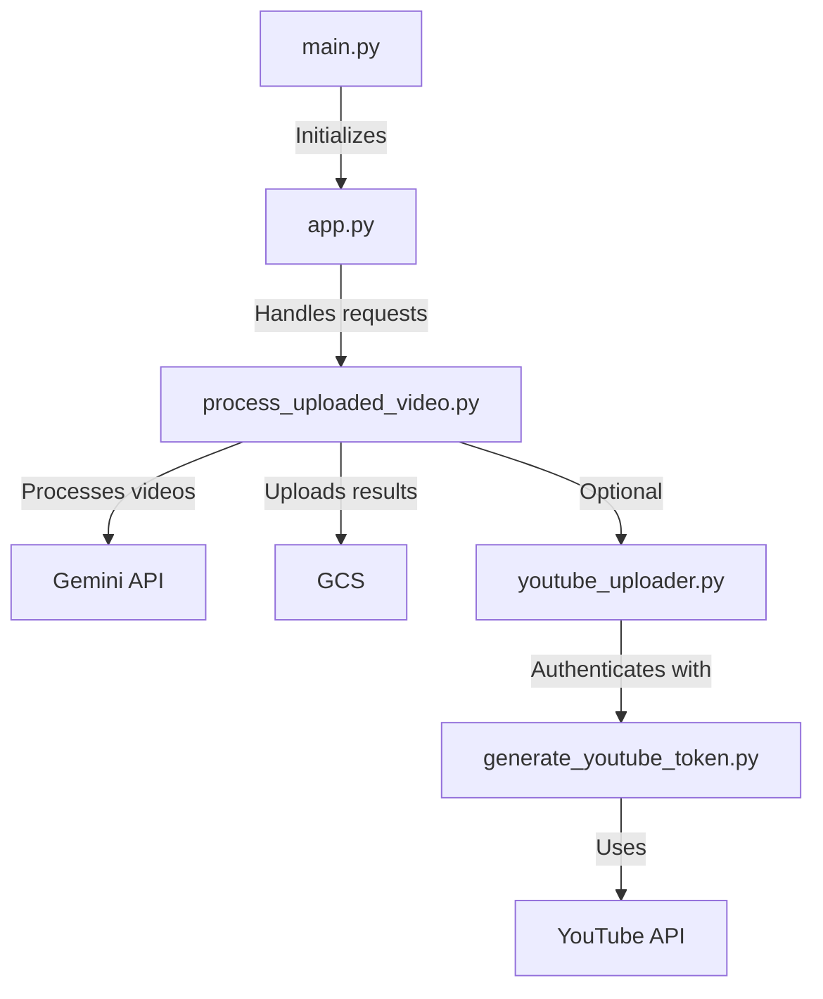
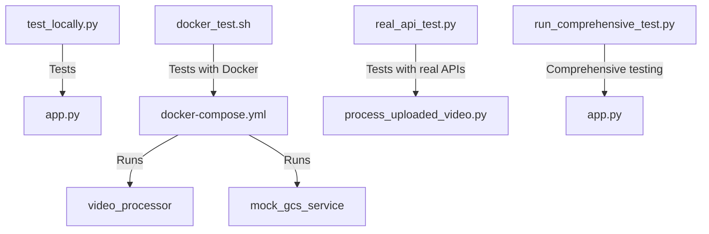

# Project Structure Guide

This document provides a clear overview of the project structure to help new developers understand the codebase.

## Directory Structure

```
Automations/
├── video_processor/           # Main application code
│   ├── __init__.py            # Package initialization
│   ├── main.py                # Entry point for Cloud Run service
│   ├── app.py                 # Flask application
│   ├── process_uploaded_video.py  # Core video processing logic
│   ├── youtube_uploader.py    # YouTube upload functionality
│   ├── generate_youtube_token.py  # YouTube OAuth token generation
│   └── tests/                 # Unit and integration tests
│       ├── conftest.py        # Pytest fixtures
│       ├── test_*.py          # Test files
│       └── ...
├── scripts/                   # Utility scripts
│   ├── test_locally.py        # Script for local testing
│   ├── docker_test.sh         # Docker-based testing script
│   ├── real_api_test.py       # Testing with real API calls
│   ├── local_test.sh          # Script to run local Docker environment
│   └── run_comprehensive_test.py  # Comprehensive test script
├── test_data/                 # Test data directory
│   ├── daily-raw/             # Raw test videos
│   ├── processed-daily/       # Processed test outputs
│   └── *.mp4                  # Sample test videos
├── docs/                      # Documentation
│   ├── TESTING_GUIDE.md       # Comprehensive testing guide
│   ├── QUICK_TEST_GUIDE.md    # Quick testing guide
│   ├── PROJECT_STRUCTURE.md   # This file
│   └── VISUAL_TESTING_GUIDE.md # Visual testing guide
├── credentials/               # Credentials directory
│   └── service_account.json   # Service account credentials
├── Dockerfile                 # Container definition
├── docker-compose.yml         # Docker Compose configuration
├── requirements.txt           # Python dependencies
├── deploy.sh                  # Deployment script
└── README.md                  # Project overview
```

## Key Components and Their Relationships

### Core Application Components



### Testing Components



## Component Descriptions

### Core Components

- **main.py**: Entry point for the Cloud Run service. Initializes the Flask app and handles configuration.
- **app.py**: Flask application that handles HTTP requests and routes them to the appropriate handlers.
- **process_uploaded_video.py**: Core logic for processing videos, including audio extraction, Gemini API calls, and result storage.
- **youtube_uploader.py**: Handles uploading videos to YouTube with the generated metadata.
- **generate_youtube_token.py**: Utility for generating and managing YouTube API OAuth tokens.

### Testing Components

- **test_locally.py**: Script for testing the application locally without Docker.
- **docker_test.sh**: Script for testing the application with Docker Compose.
- **real_api_test.py**: Script for testing with real API calls to see actual outputs.
- **run_comprehensive_test.py**: Comprehensive test script that verifies all aspects of the application.
- **local_test.sh**: Script to run the local Docker environment for development and testing.

### Configuration Files

- **Dockerfile**: Defines the container image for the application.
- **docker-compose.yml**: Defines the Docker Compose configuration for local development and testing.
- **requirements.txt**: Lists the Python dependencies for the application.
- **deploy.sh**: Script for deploying the application to Cloud Run.

## Testing Workflow

1. **Quick Local Testing**: Use `test_locally.py` for quick tests without Docker.
2. **Docker-based Testing**: Use `docker_test.sh` for more comprehensive testing with Docker.
3. **Real API Testing**: Use `real_api_test.py` to test with real API calls and see actual outputs.
4. **Comprehensive Testing**: Use `run_comprehensive_test.py` for end-to-end testing.
5. **Deployment Testing**: Use `deploy.sh --dry-run` to test the deployment process without actually deploying.

## Development Workflow

1. Make changes to the code
2. Run local tests to verify changes
3. Run Docker-based tests for more comprehensive verification
4. Run real API tests if needed to see actual outputs
5. Deploy to Cloud Run using the deployment script

## Common Paths and Patterns

- **Raw Videos**: Uploaded to `daily-raw/` or `main-raw/` in the GCS bucket
- **Processed Results**: Stored in `processed-daily/` or `processed-main/` in the GCS bucket
- **Test Data**: Stored in the `test_data/` directory for local testing
- **Logs**: Deployment logs are stored in the `logs/` directory

## Environment Variables

- **TESTING_MODE**: Set to "true" to enable testing mode (mock APIs)
- **REAL_API_TEST**: Set to "true" to use real API calls in testing
- **LOCAL_OUTPUT**: Set to "true" to write outputs to the local filesystem
- **GOOGLE_APPLICATION_CREDENTIALS**: Path to service account credentials
- **GOOGLE_CLOUD_PROJECT**: Google Cloud project ID
- **PORT**: Port for the Flask application to listen on
