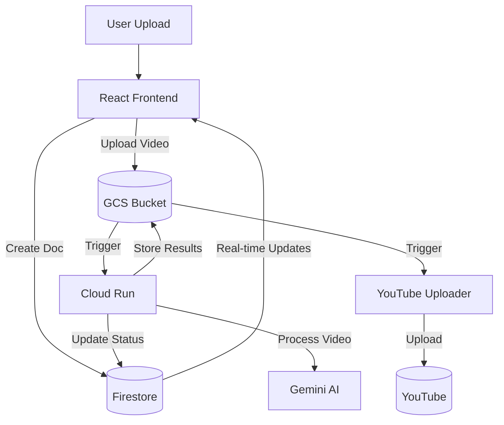
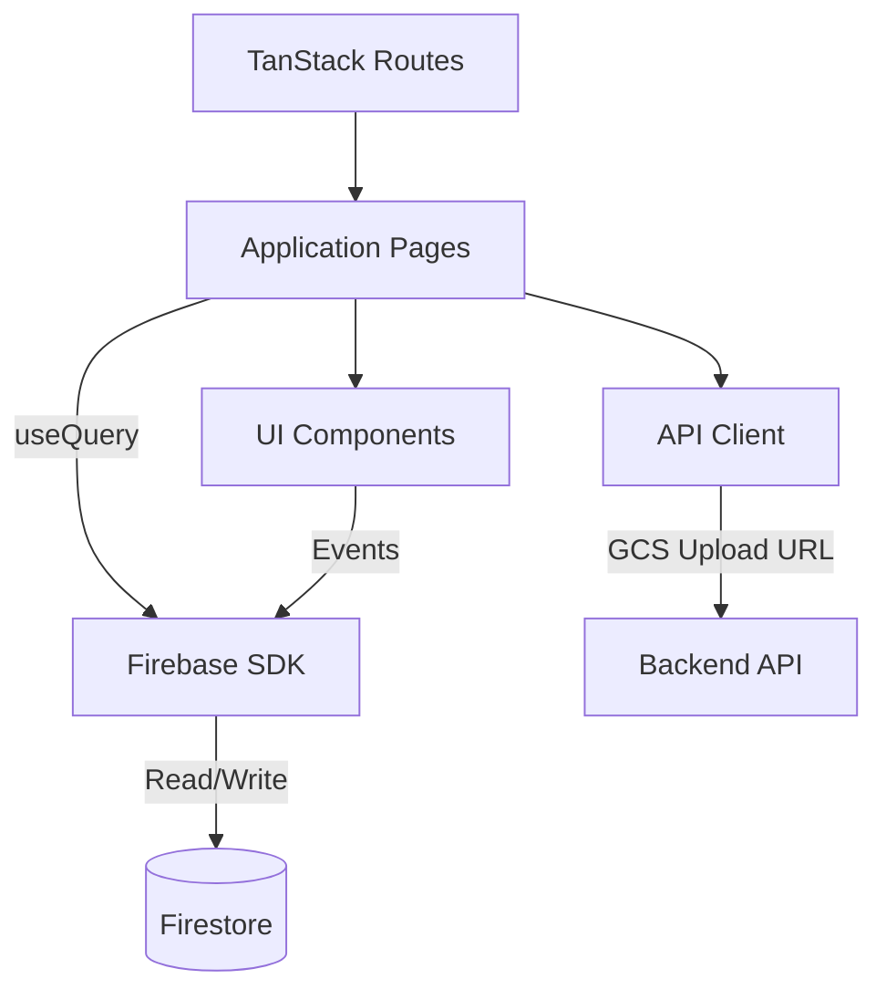
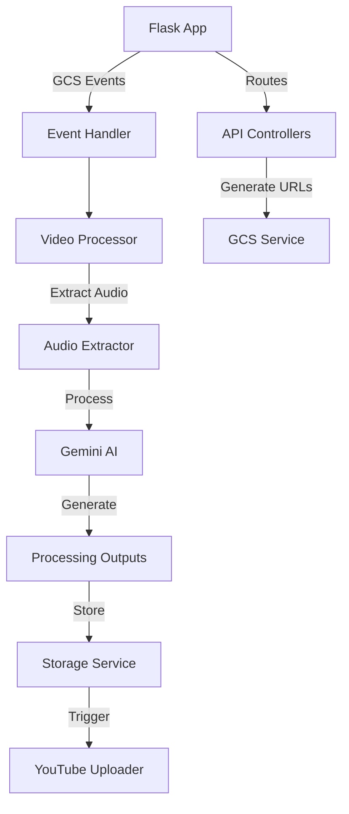

# 📁 Project Structure Guide

This document provides a comprehensive overview of the project structure to help developers understand the codebase organization and key components.

## Directory Structure

The project is organized into a clear frontend/backend split for better maintainability:

```
Automations/
├── @credentials/              # Service account credentials (not committed to git)
│   └── service_account.json   # Google Cloud service account key
├── backend/                   # Python backend code
│   ├── Dockerfile             # Backend container definition
│   ├── deploy.sh              # Backend deployment script
│   ├── docker-compose.yml     # Docker Compose for backend services
│   ├── requirements.txt       # Python dependencies
│   ├── scripts/               # Backend utility scripts
│   │   ├── create_sample_videos_firestore.py
│   │   ├── docker_test.sh     # Docker-based testing
│   │   ├── local_test.sh      # Local environment setup
│   │   ├── real_api_test.py   # Testing with real APIs
│   │   └── simulate_firestore_update.py  # Test Firestore triggers
│   ├── test_data/             # Test videos and outputs
│   │   ├── daily-raw/         # Raw test videos
│   │   └── processed-daily/   # Processed outputs
│   ├── tests/                 # Test suite
│   │   ├── unit/              # Unit tests
│   │   ├── integration/       # Integration tests
│   │   ├── e2e/               # End-to-end tests
│   │   └── conftest.py        # Test fixtures
│   └── video_processor/       # Core backend application
│       ├── api/               # API endpoints
│       │   ├── controllers.py
│       │   ├── routes.py
│       │   └── schemas.py
│       ├── app.py             # Flask application
│       ├── config/            # Configuration
│       │   ├── environment.py
│       │   └── settings.py
│       ├── core/              # Core domain logic
│       │   ├── models/        # Domain models
│       │   └── processors/    # Processing components
│       ├── services/          # External services
│       │   ├── storage/       # Storage services (GCS, local)
│       │   ├── ai/            # AI model services
│       │   └── youtube/       # YouTube integration
│       ├── utils/             # Shared utilities
│       └── youtube_uploader.py  # YouTube upload functionality
├── docs/                      # Documentation
│   ├── DOCKER_SETUP.md        # Docker development setup
│   ├── MONITORING_GUIDE.md    # Monitoring guide
│   ├── PROJECT_STRUCTURE.md   # This file
│   ├── TESTING_GUIDE.md       # Testing guide
│   ├── VISUAL_TESTING_GUIDE.md # Visual test examples
│   ├── YOUTUBE_UPLOADER_CHANGES.md  # YouTube uploader features
│   └── archive/               # Archived documentation
├── frontend/                  # React frontend code
│   ├── README.md              # Frontend documentation
│   ├── app/                   # React application
│   │   ├── api.ts             # API client
│   │   ├── components/        # UI components
│   │   │   ├── home/          # Home page components
│   │   │   ├── shared/        # Shared components
│   │   │   ├── ui/            # UI library components
│   │   │   └── video/         # Video-related components
│   │   ├── lib/               # Utility libraries
│   │   ├── routes/            # Application routes
│   │   │   ├── dashboard.tsx  # Dashboard page
│   │   │   ├── index.tsx      # Home page
│   │   │   ├── settings.tsx   # Settings page
│   │   │   ├── upload.tsx     # Upload page
│   │   │   └── video.$videoId.tsx  # Video detail page
│   │   └── styles/            # CSS styles
│   ├── firebase.ts            # Firebase/Firestore configuration
│   ├── package.json           # Frontend dependencies
│   └── public/                # Static assets
├── memory-bank/               # Project context documents
│   ├── activeContext.md       # Current work context
│   ├── productContext.md      # Product context
│   ├── projectbrief.md        # Project overview
│   ├── techContext.md         # Technology context
│   └── testing-strategy.md    # Testing strategy
├── docker-compose.yml         # Main Docker Compose config
├── docker-start.sh            # Script to start Docker services
├── docker-stop.sh             # Script to stop Docker services
├── docker-logs.sh             # Script to view Docker logs
├── docker-test.sh             # Script to run Docker tests
├── monitor-services.sh        # Script to monitor Cloud Run services
└── README.md                  # Project overview
```

## Key Components and Their Relationships

### System Architecture



### Frontend Architecture



### Backend Architecture



## Component Descriptions

### Frontend Components

- **app/routes/**: TanStack Router routes for different pages
- **app/components/**: React components organized by feature
- **app/api.ts**: API client for backend communication
- **firebase.ts**: Firebase/Firestore configuration and integration
- **app/components/video/**: Components for video processing UI
- **app/components/ui/**: Reusable UI components using shadcn

### Backend Components

- **video_processor/api/**: API endpoints and controllers
- **video_processor/core/processors/**: Video processing logic
- **video_processor/services/storage/**: Storage service implementations (GCS, local)
- **video_processor/services/ai/**: AI service integrations (Gemini)
- **video_processor/services/youtube/**: YouTube API integration
- **video_processor/youtube_uploader.py**: YouTube upload functionality

### Utility Scripts

- **docker-start.sh**: Starts frontend and backend Docker containers
- **docker-stop.sh**: Stops Docker containers
- **docker-logs.sh**: Views Docker container logs
- **docker-test.sh**: Runs automated tests with Docker
- **monitor-services.sh**: Monitors deployed Cloud Run services
- **backend/scripts/**: Backend-specific utility scripts

## Key Workflows

### Development Workflow

1. **Start the environment**: `./docker-start.sh`
2. **Make code changes** in frontend or backend
3. **Test changes**: 
   - Frontend: View at http://localhost:3000
   - Backend: Test API at http://localhost:8080
4. **Run automated tests**: `./docker-test.sh`
5. **Stop the environment**: `./docker-stop.sh`

### Video Processing Workflow

1. User **uploads video** on frontend
2. Frontend gets **signed URL** from backend API
3. Frontend **uploads to GCS** directly
4. GCS trigger **invokes Cloud Run**
5. Backend **processes video** using Gemini
6. Backend **stores results** in GCS and updates Firestore
7. Frontend shows **real-time updates** via Firestore
8. YouTube uploader **publishes to YouTube**

## Storage Organization

### Google Cloud Storage

- **automations-youtube-videos-2025**: Main GCS bucket
  - **/daily-raw/**: Raw videos for daily content
  - **/processed-daily/**: Processed outputs for daily content
  - **/main-raw/**: Raw videos for main channel content
  - **/processed-main/**: Processed outputs for main channel content

### Firestore

- **"videos"** collection: Document per video
  - **video_id**: Unique identifier
  - **filename**: Original filename
  - **current_stage**: Current processing stage
  - **stages_completed**: Array of completed stages
  - **error**: Error information (if any)
  - **metadata**: Video metadata (title, description, etc.)
  - **thumbnails**: Array of thumbnail information
  - **editable_fields**: User-editable fields

## Environment Variables

### Backend Environment Variables

- **GOOGLE_APPLICATION_CREDENTIALS**: Path to service account JSON
- **GCS_UPLOAD_BUCKET**: GCS bucket for video uploads
- **TESTING_MODE**: Enable testing mode (mock APIs)
- **GOOGLE_CLOUD_PROJECT**: Google Cloud project ID
- **GEMINI_MODEL**: Gemini model to use
- **DEFAULT_PRIVACY_STATUS**: Default YouTube privacy (unlisted/private/public)

### Frontend Environment Variables

- **VITE_API_URL**: Backend API URL
- **VITE_FIREBASE_CONFIG**: Firebase configuration (in .env)

## Testing Strategy

For a detailed testing strategy, see [testing-strategy.md](../memory-bank/testing-strategy.md).
