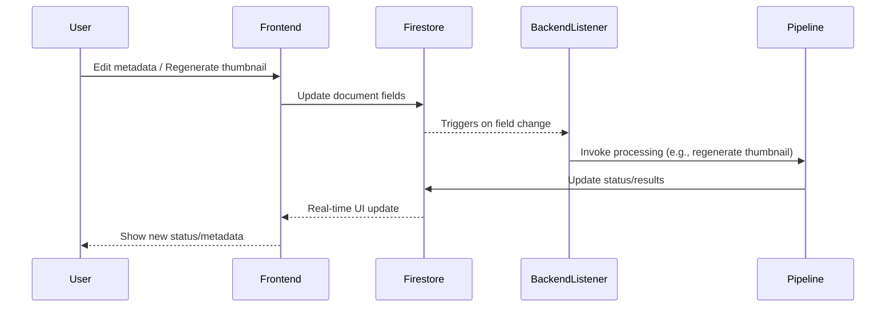

# Active Context

_Last reviewed and confirmed up to date: 2025-04-30 11:34 EDT_

**Current Work Focus:**  
- **[NEW Highest Priority]** Adopted a unified, E2E-first testing strategy ([testing-strategy.md](./testing-strategy.md)) to ensure all critical paths are validated in real-world scenarios. The atomic checklist in that doc is now the main driver for all testing and development work.
- **[COMPLETED]** Backend Firestore trigger listener integration tests implemented and passing: Simulate Firestore document changes in a test collection and assert backend triggers correct actions (metadata update, thumbnail regeneration).
- **[COMPLETED]** Upload drop zone implemented and tested: DropZone component (shadcn + Tailwind) with drag-and-drop and file input for .mp4 files, integrated into Upload page, with comprehensive component tests (React Testing Library + Vitest) all passing.
- Firestore integration is restored in the frontend: a single firebase.js at the root is used for all Firestore access. Video metadata editing (title, description, tags, scheduledTime) is now live, using shadcn UI components styled with Tailwind. Backend trigger listener can now respond to UI-driven changes. (Removed duplicate firebase.js, updated imports, and refactored UI.)
- Rebuild and verify all frontend routes and navigation after manual intervention to get TanStack Start running. Many routes were deleted to restore frontend functionality; restoring and properly configuring these routes is now secondary.
- Ensure all required pages (Dashboard, VideoDetail, Upload, Settings, etc.) are routed and render without errors.
- Verify navigation and UI state management in the frontend.
- Frontend: VideoDetailPage supports inline editing of video metadata (title, description, tags, scheduled time) and thumbnail prompt editing/regeneration.
- Dashboard and route structure using TanStack Router, connected to live Firestore data for real-time video status and metadata.
- Backend: CLI-based Firestore collection/document creation is operational using service account credentials.
- Ensuring robust testing and modular design across both frontend and backend.
- All backend and frontend tasks are explicitly tracked in progress.md, including detailed YouTube uploader subtasks.

**Recent Changes:**  
- Manual intervention: deleted many frontend routes to get TanStack Start running; frontend now boots but routing is incomplete.
- **Regression:** Recent "video123 header changes" broke the Firestore trigger integration; backend no longer responds to UI-driven Firestore updates and pipeline triggers. This has now been fixed: Firestore integration is restored in the frontend, and backend triggers can again respond to UI-driven changes.
- Firestore trigger integration was previously implemented and verified: backend/video_processor/firestore_trigger_listener.py listens for changes in "videos" collection and triggers backend processing.
- Simulated Firestore updates using backend/scripts/simulate_firestore_update.py to confirm end-to-end trigger flow.
- VideoDetailPage updated to fetch video data from Firestore by videoId.
- Added inline editing and saving for title, description, tags, and scheduled time, with changes persisted to Firestore.
- Thumbnails section now supports prompt editing and "Regenerate" action for each thumbnail, updating Firestore and ready for backend trigger integration.
- Firestore integration is live in the frontend; DashboardPage displays real-time video data from Firestore.
- Created and tested CLI workflow for Firestore collection/document creation using backend/scripts/create_sample_videos_firestore.py and service account credentials.
- Backend Python environment is fully self-contained in backend/venv with requirements.txt in backend/.
- Updated progress.md to include all specific backend and frontend tasks, matching ROADMAP.md granularity.
- Major project reorganization: backend code moved to /backend/, Vite React app scaffolded, TanStack Router/Query installed, documentation updated, Vite dev server verified, basic YouTube uploader and channel support implemented.

**Next Steps:**  
- **[Highest Priority]** Continue executing the atomic checklist in [testing-strategy.md](./testing-strategy.md). Next step: E2E test harness setup (Cypress/Playwright or custom), then further integration/E2E coverage.
- Only after E2E and integration tests are in place: Rebuild and verify all frontend routes and navigation in frontend/app/routes.
- Ensure all required pages (Dashboard, VideoDetail, Upload, Settings, etc.) are routed and render without errors.
- Only after routing is stable: resume E2E tests for backend and frontend to verify the full workflow from UI action to backend processing and back.
- Migrate all frontend code from JavaScript to TypeScript.
- Ensure the frontend app runs successfully after migration.
- Add and run tests to verify UI elements render as expected.
- Continue backend enhancements: custom thumbnails, scheduling, tags, Skool post generator, daily AI news generator, etc.
- Improve CI/CD pipeline and monitoring.
- Increase test coverage for edge cases and error conditions.

**Active Decisions and Considerations:**  
- Highest priority is executing the unified, E2E-first testing strategy and atomic checklist in [testing-strategy.md](./testing-strategy.md). All other work is gated on this.
- End-to-end (E2E) tests are required for both backend and frontend to ensure reliability of the Firestore trigger integration and the overall workflow, but only after backend is fixed and routing is stable.
- All tasks are tracked at a granular level in progress.md for full project visibility.
- Adopted clear frontend/backend split for maintainability and clarity.
- Firestore (GCP-native) is the source of truth for all video status and metadata.
- Vite + React + TanStack stack chosen for fast, modern, client-side UI.
- No authentication required for initial local use.
- Prioritize features by impact and ease (see ROADMAP.md ICE scores).
- Maintain high test coverage and modularity.

**Learnings and Project Insights:**  
- Firestore triggers enable seamless, automated backend processing in response to UI actions, closing the loop between frontend and backend.
- Inline editing and real-time Firestore updates provide a seamless user experience for video metadata management.
- CLI-based Firestore automation (using service account credentials) enables rapid, reproducible setup of collections and test data without the GUI.
- Explicit, checklist-style tracking in progress.md prevents loss of context and ensures nothing is missed.
- Clear separation of frontend and backend accelerates development and onboarding.
- Modern frontend stack (Vite, TanStack) enables rapid prototyping and real-time features.
- Modular, event-driven design enables easy extension and robust automation.
- Comprehensive testing is critical for reliability in a cloud-native pipeline.

---

**Firestore Trigger Flow (Mermaid):**

**Source:**  
- [ROADMAP.md](../ROADMAP.md) (Planned Features, Technical Improvements)  
- [README.md](../README.md) (Development Workflow, Recent Enhancements)
