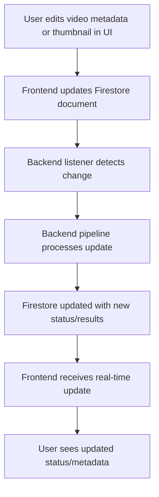

# Progress

_Last reviewed and confirmed up to date: 2025-04-30 11:34 EDT_

**What Works:**  
- Core pipeline: video upload to GCS, automatic processing, AI metadata generation, and YouTube upload
- **Firestore integration is restored in the frontend.** A single firebase.js at the root is used for all Firestore access. Video metadata editing (title, description, tags, scheduledTime) is now live, using shadcn UI components styled with Tailwind. Backend listener can now respond to UI-driven changes.
- Robust test suite for main processing and YouTube integration
- Modular, event-driven architecture
- Support for both Daily and Main channel workflows
- Prevention of duplicate uploads
- Major project reorganization: all backend code, scripts, and test data grouped under `/backend/`
- New `/frontend/` directory with scaffolded React (Vite) app, TanStack Router/Query installed
- Firestore integration: frontend displays real-time video status and metadata from Firestore
- CLI-based Firestore collection/document creation using service account credentials (backend/scripts/create_sample_videos_firestore.py)
- Backend Python environment is now fully self-contained in `/backend/venv` with `requirements.txt` in `/backend/`
- Documentation updated to reflect new structure and workflow
- Vite dev server runs and serves the new frontend app
- **VideoDetailPage fetches real Firestore data and supports inline editing and saving of video metadata (title, description, tags, scheduled time)**
- **Thumbnails section in VideoDetailPage supports prompt editing and "Regenerate" action for each thumbnail, updating Firestore and ready for backend trigger integration**

**What's Left to Build:**  
- **[Highest Priority]** Adopted a unified, E2E-first testing strategy ([testing-strategy.md](./testing-strategy.md)). All testing, E2E, and integration progress is now tracked via the atomic checklist in that doc.
- **[COMPLETED]** Backend Firestore trigger listener integration tests implemented and passing: Simulate Firestore document changes in a test collection and assert backend triggers correct actions (metadata update, thumbnail regeneration).
- **[COMPLETED]** Upload drop zone implemented and tested: DropZone component (shadcn + Tailwind) with drag-and-drop and file input for .mp4 files, integrated into Upload page, with comprehensive component tests (React Testing Library + Vitest) all passing.
- Only after the atomic checklist is underway:
  - [ ] Rebuild and verify all frontend routes and navigation in `frontend/app/routes` after manual intervention to get TanStack Start running. Many routes were deleted to restore frontend functionality; restoring and properly configuring these routes is now secondary.
    - [ ] Ensure all required pages (Dashboard, VideoDetail, Upload, Settings, etc.) are routed and render without errors
    - [ ] Verify navigation and UI state management
  - [ ] Migrate all frontend code from JavaScript to TypeScript
  - [ ] Ensure the frontend app runs successfully after migration
  - [ ] Add and run tests to verify UI elements render as expected
- Backend enhancements: Skool post generator, daily AI news generator, etc.

---

## Unified Testing Strategy & Checklist

- See [testing-strategy.md](./testing-strategy.md) for the comprehensive, atomic checklist covering backend, frontend, and E2E testing.
- **[COMPLETED]** Backend: Firestore trigger listener integration tests implemented and passing (simulate Firestore document changes, assert backend triggers correct actions).
- **[COMPLETED]** Frontend: Upload drop zone implemented and tested (DropZone component, integrated, all component tests passing).
- All progress on testing, E2E, and integration is now tracked there.

### YouTube Uploader Enhancements
  - [ ] Add support for custom thumbnails
  - [ ] Implement scheduling for video publishing
  - [ ] Add better prompt for the chapter markers
  - [ ] Generate 10 title options using vid IQ logic and send Discord message to pick one
  - [ ] Generate 4 thumbnails using custom workflow with Pillow (see prd.txt)
  - [ ] Add support for video tags and cards
  - [ ] Automatically add a comment from my account and pin it to the video with a custom message
- CI/CD improvements and automated deployment
- Cloud monitoring and alerting
- Cost optimization and disaster recovery procedures
- Additional test coverage for edge cases and error conditions

**Current Status:**  
- Project structure is clean and maintainable, with clear separation of frontend and backend
- **Backend Firestore trigger listener integration tests are now implemented and passing. Next step: E2E test harness setup (Cypress/Playwright or custom), then further integration/E2E coverage.**
- **Regression fixed:** Firestore integration is restored in the frontend, with a single firebase.js at the root. Video metadata editing is live and uses shadcn UI components with Tailwind. Backend triggers can now respond to UI-driven changes.
- **Frontend routing and navigation are currently incomplete after manual intervention; many routes were deleted to restore TanStack Start functionality. Rebuilding and verifying all routes is now secondary to verifying backend triggers.**
- Frontend UI for video metadata and thumbnail management is partially complete and integrated with Firestore, but navigation and some pages are missing or broken.
- Backend code, scripts, and test data consolidated under `/backend/`
- Documentation and memory bank fully updated

**Known Issues:**  
- **No known issues with Firestore integration.** Backend and frontend are now reconnected. All new UI uses shadcn components and Tailwind for styling.
- Frontend routing/navigation is incomplete; some pages are missing or broken after route deletions.
- Need to ensure all scripts and documentation reference new paths
- E2E test coverage is not yet complete for the new Firestore trigger flow

**Evolution of Project Decisions:**  
- Adopted frontend/backend split for maintainability and clarity
- Chose Vite + React + TanStack for frontend, Firestore for real-time backend data
- Roadmap and README.md are referenced for ongoing updates and reprioritization
- ICE scoring used to prioritize enhancements

---

**System Flow (Mermaid):**

**Source:**  
- [ROADMAP.md](../ROADMAP.md) (Technical Improvements, Vision)  
- [README.md](../README.md) (Testing, Deployment, Enhancements)
