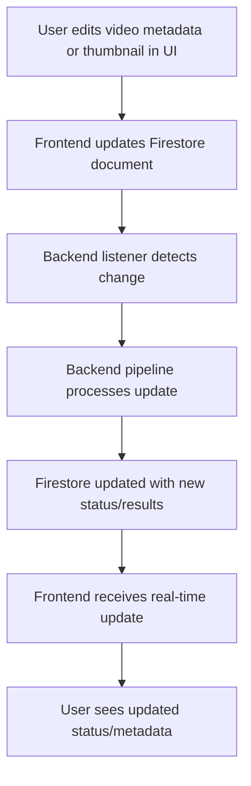

# Progress

**What Works:**  
- Core backend pipeline: video upload to GCS, automatic processing, AI metadata generation, and YouTube upload
- Firestore trigger integration: backend listener detects UI-driven changes to video documents and triggers backend processing (thumbnail regeneration, metadata updates)
- Robust test suite for main processing and YouTube integration  
- Backend integration tests for Firestore trigger listener implemented and passing (`pytest -m integration`)
- Modular, event-driven architecture
- Support for both Daily and Main channel workflows
- Prevention of duplicate uploads
- Major project reorganization: all backend code, scripts, and test data grouped under `/backend/`
- New `/frontend/` directory with React (Vite) app scaffolded and TanStack Start running
- Frontend app now starts successfully after manual deletion of problematic routes
- **All main frontend routes (Dashboard, Video Detail, Upload, Settings) have been systematically audited and updated for:**
  - Firestore integration with real-time updates (`onSnapshot`)
  - Inline editing and thumbnail management (Video Detail)
  - Consistent use of shadcn UI components and Tailwind styling
  - Robust upload flow using GCS signed URLs and Firestore doc creation (Upload)
  - Settings page structure for future extensibility
- Dashboard: Real-time video list, navigation, shadcn Card components
- Video Detail: Inline metadata editing, thumbnail prompt editing/regeneration, real-time updates, shadcn UI
- Upload: Drop zone, GCS signed URL upload, Firestore doc creation, shadcn Card UI
- Settings: Now uses shadcn Card and Tailwind, structured for future settings
- TypeScript and routing issues resolved; firebase.d.ts added for type safety
- Firestore integration: backend and scripts for collection/document creation are operational
- Backend Python environment is now fully self-contained in `/backend/venv` with `requirements.txt` in `/backend/`
- Documentation updated to reflect new structure and workflow
- **Frontend upload page now uses GCS signed URLs for video uploads in production.** The backend provides a `/api/gcs-upload-url` endpoint, and the frontend uploads directly to GCS and creates a Firestore doc with the GCS URL.
- **Upload pipeline improved:** Frontend now uses the GCS URL returned by the backend, ensuring robust and environment-agnostic Firestore document creation.
    - The backend `/api/gcs-upload-url` endpoint now returns the signed upload URL, bucket name, object path, and canonical GCS object URL. The frontend uses this `gcs_url` for Firestore document creation, eliminating reliance on frontend environment variables and preventing broken links or config drift.
    - This change guarantees that all Firestore video records have a valid, production-ready GCS URL, regardless of deployment environment. It also simplifies onboarding and future maintenance.
- **Video Detail page now uses real-time Firestore updates (onSnapshot) for instant UI sync with backend-triggered changes.**
    - The detail page previously used a one-time `getDoc` fetch, so users had to refresh to see pipeline or backend changes. Now, it uses Firestore's `onSnapshot` for live updates, ensuring the UI always reflects the latest status, metadata, and thumbnails.
    - This supports a seamless, event-driven user experience and aligns with the project's real-time architecture.
- **TypeScript type safety for Firestore integration is enforced via a dedicated `firebase.d.ts` declaration.**
    - This prevents type errors, improves code completion, and ensures all modules importing `db` from `../../firebase` are type-safe, even though the config is in JS.
- **Frontend-backend API communication now works properly with Vite server proxy configuration in app.config.ts.**
    - Fixed the issue where the upload page couldn't reach the backend Flask app for `/api/gcs-upload-url` requests.
    - Added proper proxy configuration to forward `/api/*` requests to the backend running on port 8080.
- **Development workflow improved with convenient service management scripts:**
    - `start-services.sh`: Automates starting both backend and frontend with proper environment setup
    - `stop-services.sh`: Safely stops all development services
    - Log files stored in `/logs/` directory for easy debugging

**What's Left to Build:**  
- Begin E2E and integration test implementation for all main user flows (upload, edit, thumbnail regeneration, real-time updates)
  - [ ] E2E tests for Firestore trigger integration (UI action → backend → UI update)
  - [ ] E2E tests for YouTube upload and metadata roundtrip
  - [ ] Use test GCS bucket and Firestore collection for E2E tests
  - [ ] Add cleanup logic for test data after E2E runs
  - [ ] Document and automate E2E test flow (local and CI)
- Migrate all frontend code from JavaScript to TypeScript
- Add/verify component tests for upload, metadata editing, thumbnail regeneration
- Backend enhancements: Skool post generator, daily AI news generator, etc.

### YouTube Uploader Enhancements
  - [ ] Add support for custom thumbnails
  - [ ] Implement scheduling for video publishing
  - [ ] Add better prompt for the chapter markers
  - [ ] Generate 10 title options using vid IQ logic and send Discord message to pick one
  - [ ] Generate 4 thumbnails using custom workflow with Pillow (see prd.txt)
  - [ ] Add support for video tags and cards
  - [ ] Automatically add a comment from my account and pin it to the video with a custom message
- CI/CD improvements and automated deployment
- Cloud monitoring and alerting
- Cost optimization and disaster recovery procedures
- Additional test coverage for edge cases and error conditions

**Current Status:**  
- Project structure is clean and maintainable, with clear separation of frontend and backend.
- Firestore trigger integration is operational and verified.
- **All main frontend routes have been audited and updated for Firestore integration, real-time updates, and UI/UX consistency.**
- Frontend app runs; Dashboard, Video Detail, Upload, and Settings routes are restored and functional, including thumbnail management and real-time updates.
- **Upload page now uses GCS signed URLs for production uploads; Firestore doc is created with the canonical GCS URL returned by the backend, not constructed on the frontend.**
    - This ensures all video records are valid and portable, and removes a major source of environment-specific bugs.
- **Video Detail page now uses Firestore `onSnapshot` for real-time UI updates, so users see instant feedback for all backend and pipeline changes.**
- **TypeScript type safety is enforced for Firestore integration, reducing runtime errors and improving developer experience.**
- **Frontend-backend API communication now works correctly with Vite server proxy configuration.**
    - The upload page can now successfully request signed URLs from the backend Flask app.
- **Development workflow streamlined with service management scripts.**
    - Services can be started and stopped with single commands.
    - All necessary environment setup (venv activation, environment variables) is automated.
- Backend code, scripts, and test data consolidated under `/backend/`.
- Documentation and memory bank fully updated with rationale and technical decisions for all major changes.

**Known Issues:**  
- Need to ensure all scripts and documentation reference new paths
- E2E test coverage is not yet complete for the new Firestore trigger flow

**Evolution of Project Decisions:**  
- **Clarified storage architecture: GCS is canonical for video files, Firestore for metadata/status, Firebase Storage not used for video in production.**
- **Adopted signed URL pattern for secure, direct uploads from frontend to GCS.**
- **Backend now returns canonical GCS URLs for all uploads, decoupling frontend from deployment config and ensuring all Firestore records are valid and production-ready.**
- **All main UI routes (Dashboard, Video Detail, Upload, Settings) now use Firestore `onSnapshot` for real-time updates, supporting a true event-driven workflow.**
- **TypeScript type safety is enforced for Firestore integration, even with a JS-based config, via a dedicated `.d.ts` file.**
- **Frontend-backend API communication standardized with Vite server proxy configuration.**
- **Development workflow streamlined with scripted service management.**
- Adopted frontend/backend split for maintainability and clarity.
- Chose Vite + React + TanStack for frontend, Firestore for real-time backend data.
- Roadmap and README.md are referenced for ongoing updates and reprioritization.
- ICE scoring used to prioritize enhancements.

---

**System Flow (Mermaid):**

**Source:**  
- [ROADMAP.md](../ROADMAP.md) (Technical Improvements, Vision)  
- [README.md](../README.md) (Testing, Deployment, Enhancements)
