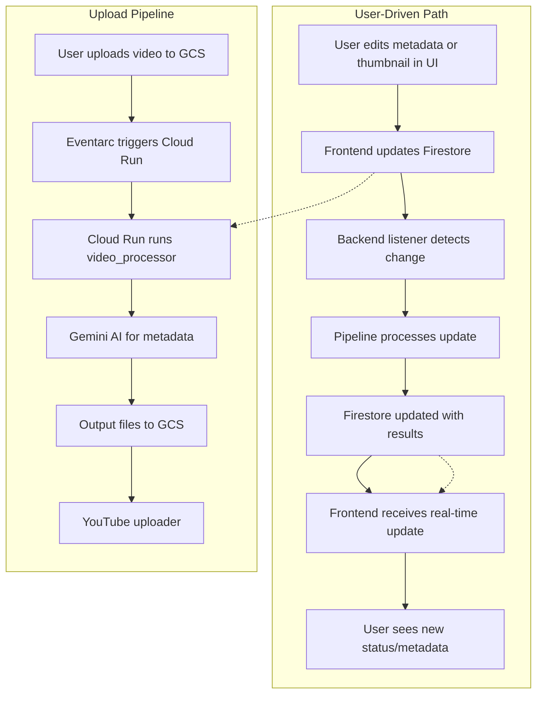

# System Patterns

**System Architecture:**  
- Event-driven pipeline using Google Cloud Storage (GCS), Eventarc, Cloud Run, and Vertex AI (Gemini)
- Firestore-triggered backend listener for UI-driven updates (metadata edits, thumbnail regeneration)
- Modular video processor for handling uploads, processing, and metadata generation
- Integration with YouTube API for automated uploads

**Key Technical Decisions:**  
- Use of Google Cloud services for scalability and reliability
- Modular design for video processing and uploader components
- Robust error handling and retry logic for API calls
- Test-driven development with comprehensive test suite
- **Adopted a unified, E2E-first testing strategy ([testing-strategy.md](./testing-strategy.md)) to ensure all critical paths are validated in real-world scenarios**
- Firestore as the real-time source of truth for video status and metadata
- Single firebase.js at the root of the frontend for all Firestore config/imports (deduplication, avoids confusion)

**Design Patterns in Use:**  
- Event-driven triggers (GCS upload → Eventarc → Cloud Run)
- Firestore-triggered backend listener (UI action → Firestore → backend listener → pipeline)
- Modular processing (separate modules for audio extraction, AI metadata generation, YouTube upload)
- Integration with external APIs (Gemini, YouTube)
- Use of marker files to prevent duplicate uploads
- All new frontend UI uses shadcn components styled with Tailwind for consistency and rapid development

**Component Relationships:**  
- GCS bucket receives video upload
- Eventarc triggers Cloud Run service
- Cloud Run runs video_processor/app.py, which:
  - Extracts audio via ffmpeg
  - Sends audio to Gemini API for metadata generation
  - Writes output files (transcript, chapters, etc.) to GCS
  - Triggers YouTube uploader for final upload
- Firestore "videos" collection stores all video status and metadata
- Frontend UI updates Firestore documents (metadata edits, thumbnail prompts)
- Backend listener (firestore_trigger_listener.py) detects Firestore changes and triggers pipeline stages as needed

**Critical Implementation Paths:**  
- Video upload → GCS → Eventarc → Cloud Run → Video Processor → Gemini AI → Output files → YouTube Uploader
- UI action → Firestore document update → Backend listener → Pipeline stage → Firestore update → UI

---

**Architecture Overview (Mermaid):**

**Recent Regression & Restoration:**  
- A recent regression ("video123 header changes") broke Firestore integration and backend triggers. This has been fully restored: frontend now uses a single firebase.js, and backend triggers again respond to UI-driven changes.

**Source:**  
- [README.md](../README.md) (System Architecture, Project Structure)  
- [ROADMAP.md](../ROADMAP.md) (Technical Improvements)
